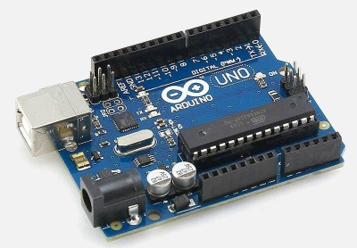

# Tkkrlab Arduino cursus

Arduino is een open-source elektronisch prototyping platform gebaseerd op flexibele, gemakkelijk te gebruiken hardware en software. De Arduino is bedoeld voor kunstenaars, ontwerpers, hobbyisten en iedereen geïnteresseerd in het maken van interactieve objecten en omgevingen.

Voordeel van open source is dat de beschikbare hard- en software geheel naar eigen wens kan worden aangepast, de schema’s en broncode is beschikbaar. 

Tevens is er een grote en levendige Arduino community die vele projecten als open source publiceren. Indien je een specifiek Arduino project wil maken en je google op “Arduino” en wat je wil maken is de kans groot dat er al iemand is die iets soortgelijks heeft gemaakt. Je kunt dan zijn project overnemen en aanpassen naar je eigen wensen.

# Tkkrlab
TkkrLab (Tukkerlab) is een hobbyplek voor techneuten. Voor de een is dit software maken of met electronica bezig zijn of een 3D printer bouwen. Voordeel om dit in een groep fysiek bij elkaar te doen is dat er altijd wel iemand aanwezig is die je verder kan helpen en het natuurlijk ook een stuk gezelliger is dan dit alleen op een zolderkamertje te doen.

Onze space heeft ook een eigen werkplaats waar je kan solderen en projecten in elkaar kan bouwen. Tevens verzorgen wij ook workshops over onderwerpen zoals de Arduino, open source software, privacy, security, elektronica etc.

TkkrLab is iedere dinsdagavond open voor iedereen, je bent dan altijd van harte welkom om een kijkje bij ons te nemen.

In nederland zijn er meer hackerspaces zoals TkkrLab, zie op http://hackerspaces.nl voor een overzicht van de spaces en hun activiteiten.

# De cursus
Tijdens de cursus leren we je hoe je de Arduino soft- en hardware kunt gebruiken om zelf slimme apparaten te maken.

We beginnen de cursus met basiskennis over elektronica. In dit eerste deel van de cursus zullen vragen als “Hoe moet ik alles aansluiten?”, “Hoe bereken ik de benodigde waarde van een weerstand uit?” en “Waar moet ik rekening mee houden als ik elektronica bouw?” worden beantwoord.

Daarna wordt een introductie gegeven over het Arduino platform: het installeren van de software, het aansluiten van de Arduino Uno op uw computer en het programmeren van het knipperlicht voorbeeld. Direct daarna krijgt je de mogelijkheid de zojuist opgedane basiskennis over elektronica in de praktijk te brengen, met het bouwen van een looplicht.

Nadat je bekend bent geraakt met het Arduino platform laten we je de uitgebreide mogelijkheden van het Arduino platform zien: het aansturen van servo motoren, LCD schermpjes en het communiceren met de computer over de seriële poort.

# Wat is Arduino?

Arduino is een open source platform bestaande uit een stukje hardware en een computerprogramma. Grote voordeel van de Arduino is dat er voor iedere doel een geschikte Arduino versie beschikbaar is en dat er een grote community aanwezig is.

Tijdens deze cursus gaan we werken met een Arduino UNO. Dat is een printplaatje dat een “ATMEGA328P” microcontroller van Atmel bevat. Voor die microcontroller kan je met de Arduino software zelf een besturingsprogramma maken.

Een microcontroller is een soort mini-computertje. De ATMEGA chip bevat een stukje opslaggeheugen, RAM, een processor. Daarnaast bevat de chip hardware om met de buitenwereld te communiceren: via generieke in/uitgangs pinnen, meerdere soorten seriële poorten en een analoog naar digitaal omzetter.

Met de Arduino software kunt je uw eigen besturingsprogramma maken, waarmee je kunt bepalen wat de chip doet. Er draait geen besturingssysteem op de chip zoals bij een normale computer, alleen jouw programma. Daardoor kan je met een microcontroller sommige taken met veel meer precisie (realtime) en stabiliteit uitvoeren met een normale computer.

Raspberry Pi kunt je ook gebruiken voor het aansturen van elektronica, maar dit is in feite een kleine computer met een volledige (linux) os. Hierdoor is een Pi ook minder geschikt voor het aansturen van een stepper motor omdat je hiervoor realtime aansturing nodig hebt. Het komt ook wel voor dat je combinaties ziet van een Raspberry Pi en een arduino, zo heb je de beste van beide werelden.
