In dit hoofdstuk bespreken we basistheorie voor het lezen van een schema en de eigenschappen van de verschillende elektronische basiscomponenten. Dit hoofdstuk eindigt met uitleg over de wet van Ohm.

# Schemas

Elektrische schakelingen worden in documentatie vaak in een schematische weergave getoond, omdat een schema vaak veel duidelijker de verbindingen in een elektrisch circuit kan laten zien dan een foto.

Een voorbeeld van een schema dat laat zien hoe je een relais aan kunt sluiten op een Arduino ziet er als volgt uit:
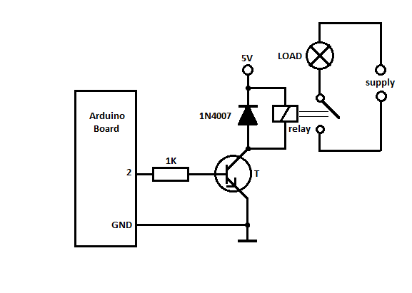

In het elektrische circuit dat hierboven staat afgebeeld zijn verschillende componenten gebruikt: een weerstand, een transistor, een diode en het relais.

## De weerstand

Een weerstand is een component dat elektrische stromen kan beperken. Doordat de weerstand de stroom limiteert ontstaat er een spanningsval over de weerstand. De wet van Ohm, die we later zullen behandelen beschrijft het lineaire verband (de verhouding) tussen de aangeleverde spanning en de stroom die door een weerstand vloeit.

In schema’s ziet een weerstand er uit als een blokje of als een zigzaggende lijn. Het blokje is het Europese symbool voor een weerstand, terwijl in Amerikaanse schema’s vaak het zigzaggende lijntje wordt gebruikt.

Weerstanden hebben geen polariteit: het maakt niet uit in welke richting een weerstand aangesloten wordt.

Aan de hand van de kleuren op de weerstand kun je aflezen welke waarde deze heeft.

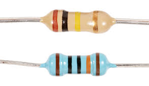

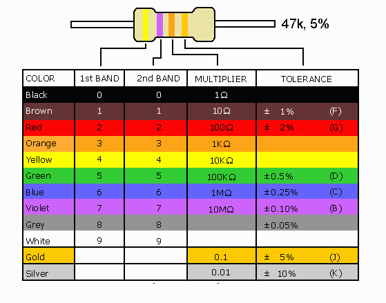

## De diode
Een didode is een halfgeleidercomponent dat slechts in één richting stroom laat vloeien: van de anode (+) naar de cathode (-). Het component werkt dus als een terugslagventiel voor stroom.

Er zijn meerdere soorten diodes, welke voor veel verschillende doelen gebruikt worden. Een aantal voorbeelden van het gebruik van diodes zijn: het gelijkrichten van spanning, het limiteren van spanning of als lichtbron: de Light Emitting Diode.

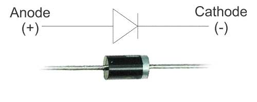

## De LED
Een LED (of Light Emitting Diode) is een diode die licht uitstraalt wanneer er stroom doorheen loopt.

Net als een normale diode werkt een LED alleen wanneer er stroom loopt van de anode (+) naar de cathode (-).

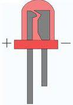

## Spanningsbronnen en “ground”
Een spanningsbron (bijvoorbeeld een batterij of een voedingsadapter) kan op meerdere manieren worden aangeduid: als “kale” spanningsbron, als pijltje met een spanning of als batterijsymbool. De polariteit staat meestal aangegeven bij het symbool.

Het referentiepunt dat als nulpunt voor spanningen binnen het schema wordt gebruikt heet het “ground” punt. Deze referentiepunten kunnen met de volgende symbolen worden aangeduid:

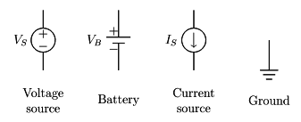

## Chips / Integrated Circuits (ICs)
In moderne schakelingen worden vrijwel altijd chips gebruikt. Chips zijn componenten die van binnen bestaan uit een groot aantal componenten als transistors, condensatoren, spoelen en diodes. Een chip bevat vrijwel altijd een stukje silicium wafer waarop de componenten geetst zijn.

Chips worden in veel verschillende verpakkingen gestopt: van relatief grote through-hole packages zoals het DIL (Dual-In-Line) formaat tot te kleinste BGA (Ball-Grid-Array) verpakkingen.

Ieder type chip is anders: daarom heeft een chip geen vaste vorm in een schema. Chips worden meestal aangeduid als een blok met een hoop aansluitingen. Bij de aansluitingen staat vrijwel altijd de functie aangegeven.

## De condensator
Condensatoren bestaan uit twee metalen plaatjes die door een met elektrolyt doordrenkt membraan gescheiden worden. Een condensator werkt als een soort batterij en zal de spanning op zijn aansluitingen constant proberen te houden. Condensatoren worden veel gebruikt voor spanningsstabilisatie, als anti-dender bescherming bij knoppen en als onderdeel van passieve hoog- of laag doorlaatfilters.

Condensatoren bestaan in verschillende typen, waarvan sommige wel en sommige geen gedefinieerde polariteit hebben. Een elektrolytische condensator (links) heeft een witte rand op de zijkant: die rand geeft aan welke aansluiting de cathode (of negatieve) aansluiting is.

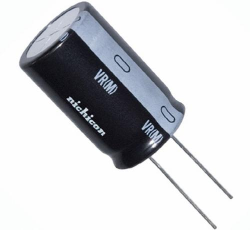

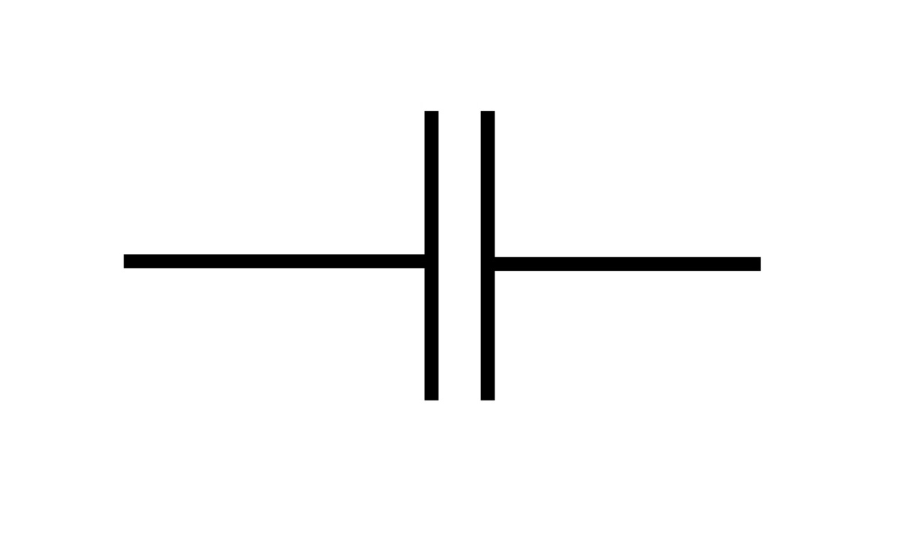

## De spoel
Spoelen zijn lange draden die rond een kern gewonden worden. Een spoel werkt als opslag voor stroom. Een spoel zal proberen de lopende stroom door de spoel constant te houden wanneer de spanning over de spoel varieert.

Het effect wat een spoel laat zien ontstaat doordat de stroom die door de spoel loopt een elektrisch veld opwekt. Wanneer de stroom door de spoel positief veranderd zal dat elektrische veld zichzelf omzetten in een magnetisch veld. Wanneer de stroom vervolgens negatief veranderd keert het proces zich om en veroorzaakt het ontstane magnetische veld een elektrisch veld en dus een stroom door de spoel.

Hoewel er in deze cursus geen gebruik gemaakt zal worden van dit component is het goed te weten dat het effect van een spoel ook optreed in langere draden en draden waarin op hoge snelheid veranderende stromen lopen. Het is daarom verstandig om bij digitale communicatie tussen componenten de draden niet langer te maken dan nodig is. Wanneer het gebruik van lange draden noodzakelijk is is het verstandig filters in te bouwen in het circuit.

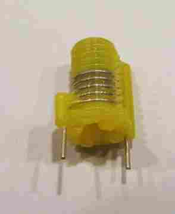


# Weerstanden in serie en parallel
De totale weerstand van in serie geplaatste weerstanden is de som van alle individuele weerstanden. je kunt de weerstandswaarden dus gewoon bij elkaar optellen.

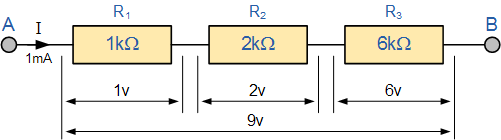

De totale weerstand van parallel geplaatste weerstanden is iets ingewikkelder. De totale weerstand van parallel geplaatste weerstanden is namelijk de inverse van de som van de inverse van iedere individuele weerstandswaarde.

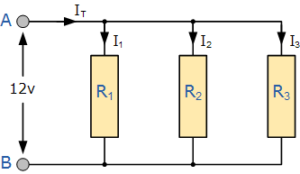

1 / R1 + 1 / R2 = 1 / Rtotaal

De formule voor twee parallel geplaatste weerstanden kan ook worden omgeschreven tot de volgende alternatieve formule:

Voorbeeld:

 - R1 = 10 Ohm
 - R2 = 15 Ohm

In serie is de totale weerstand 10 + 15 = 25 Ohm

Parallel geplaatst is de totale weerstand (1 / 10) + (1 / 15) = 6 Ohm

De totale weerstand van in serie geplaatste weerstanden wordt dus groter dan de individuele weerstandswaardes terwijl bij parallel geplaatste weerstanden de totale weerstand lager is dan de individuele weerstanden.

# De wet van Ohm
In deze cursus gaan we een LED aansluiten op een Arduino. Daarnaast gaan we werken met een potentiometer (variabele weerstand).

Om de benodigde waarden van-, de stroom door- of de spanningsval over een weerstand te kunnen bepalen is het nodig de “wet van Ohm” te gebruiken.

De wet van Ohm ziet er in formulevorm zo uit:

Zoals je ziet is dit drie maal dezelfde formule, die ons vertelt dat de weerstand in Ohm gelijk is aan de spanning in Volt gedeeld door de stroom in Ampère.

R [Ω] = weerstand in Ohm
V [V] = spanning in Volt
I [A] = stroom in Ampere

In een elektrisch schema zien de spanning(V), stroom (I) en weerstand (R) er als volgt uit:

Een enkele weerstand

Stel de batterijspanning is 10 volt en de stroom door het circuit is 2 Ampere, dan is de weerstand 10 / 2 = 5 Ohm

Stel de batterijspanning is 10 volt en de weerstand heeft een weerstand van 1000 Ohm, dan is de stroom die door het circuit loopt 10 / 1000 = 0,01 Ampere of 10 mA (milli Ampere).

Stel er loopt een stroom van 1 Ampere door het circuit heen en de weerstand is 10 Ohm, dan is de spanning over de weerstand 1 * 10 = 10 Volt
Spanningsdeler

Een spanningsdeler bestaat uit twee in serie geplaatste weerstanden. De spanningsval over R1 + R2 is Vin en de uitgang is aangesloten op het verbindingspunt tussen de twee weerstanden in. In deze situatie bepaalt de verhouding tussen R1 en R2 de spanning op de uitgang.

De uitgangsspanning kan bepaald worden met de volgende formule:

Die formule kan worden afgeleid uit de wet van Ohm:

Vout = I  R2    (Vout is gelijk aan de stroom door het circuit vermenigvuldigd met de weerstand vanR2)

I = VinR1 + R2        (De stroom door het circuit is gelijk aan Vin gedeeld door de totale weerstand)

Hieruit volgt dat Vout =Vin  R2R1 + R2, ofwel Vout = Vin R2R1 + R2

Een spanningsdeler met R1 = 680 Ohm en R2 = 1300 Ohm kan bijvoorbeeld werken als level-converter om 5 volt om te zetten naar 3.3 volt in een communicatielijn tussen twee chips.
De waarden in dit voorbeeld zijn zo gekozen dat de stroom door het circuit 2,5mA is. Bij het zelf ontwerpen van een spanningsdeler kiest je eerst de stroom die je door de spanningsdeler wilt laten lopen, dit bepaalt de totale weerstand in de spanningsdeler. Waarna de verhouding tussen de twee weerstanden de uitgangsspanning bepaald.

[Note: een spanningsdeler is niet geschikt als regulator voor de voeding van andere circuits omdat de load aan de uitgang, die parallel staat aan R2, de uitgangsspanning zal beïnvloeden]

## Een LED aan een Arduino

In deze cursus gaan we een LED aansluiten op een Arduino. Daarbij functioneert een uitgang van de Arduino als spanningsbron.

Een LED is een stroomgestuurd component. Dit betekent dat de hoeveelheid licht die een LED uitstraalt samenhangt met de stroom door de LED en niet met de spanning over de LED.

Een LED heeft net als een normale diode een vaste spanningsval. De exacte spanningsval per type LED verschilt en is in de datasheet te vinden.

De gemiddelde spanningsval van veel gebruikte soorten LEDs is meestal een waarde in de volgende richting: Rood/infrarood: 1,9 volt , Groen: 2,1 volt, Geel: 2 volt, Blauw/wit: 3,6 volt

Een uitgang op de Arduino is verbonden aan de ground (0 volt) wanneer de uitgang LAAG (uit) is en aan de voedingsspanning (5 volt) wanneer de uitgang HOOG (aan) is.

### Het probleem
Direct aansluiten van de uitgangs-pin van de Arduino aan een rode LED zorgt er voor dat er 5 volt over een diode wordt gezet die een spanningsval van 1,9 volt heeft. Dit betekent dat er ergens 3,1 volt moet worden verloren, in het pad naar de LED toe. Hoewel in theorie de interne weerstand in een Arduino en van de aansluitdraden 0 ohm is is dat in de praktijk niet het geval. Gelukkig, want dan zou de hoeveelheid stroom door het circuit oneindig hoog worden. Helaas is zelfs met de interne weerstand en draadweerstand meegenomen de stroom door het circuit nog steeds veel hoger dan de maximale stroom die een Arduino mag leveren en door de LED gestuurd mag worden. Het resultaat is een kapotte of beschadigde LED en Arduino.

### De oplossing
Door zelf extra weerstand toe te voegen aan het circuit kan de stroom door het circuit worden teruggebracht naar de gewenste hoeveelheid. Het schema van een LED aan een spanningsbron komt er daardoor als volgt uit te zien:

De spanningsval over de weerstand is in dit geval de voedingsspanning (5 volt) min de spanningsval over de led (1,9 volt): 3,1 volt dus. Stel we willen een stroom van 10 mA door het circuit laten lopen, dan hebben we een weerstand van 3,10,01= 310 ohm nodig.
