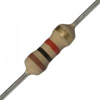
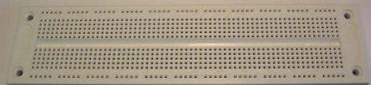
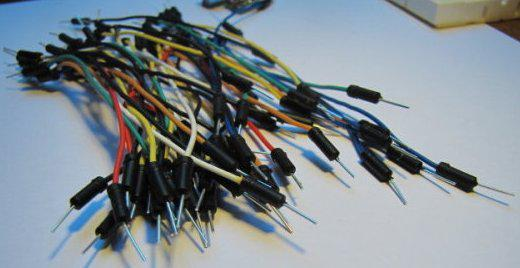
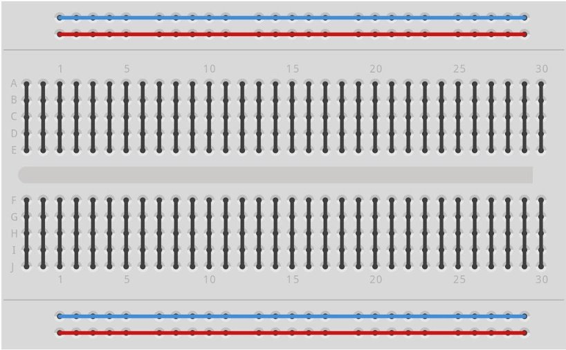
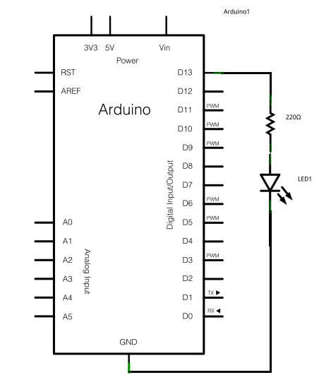
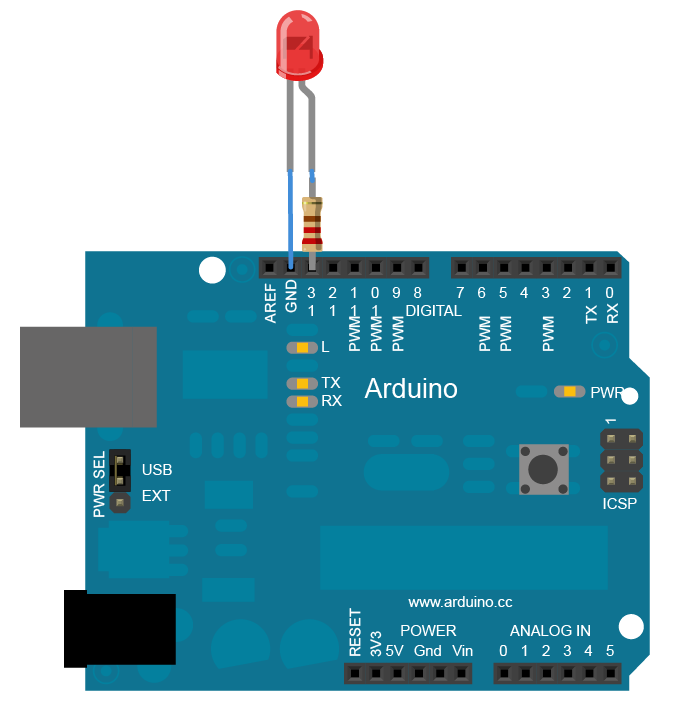
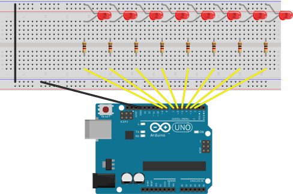
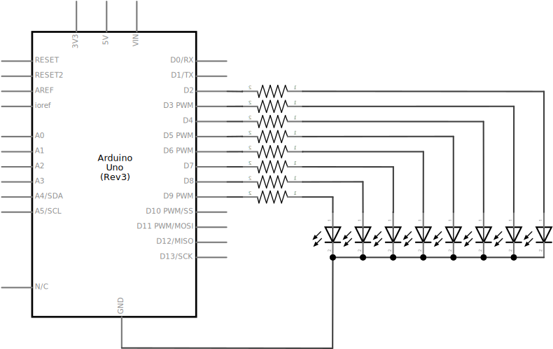
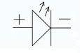

In dit hoofdstuk leer je hoe je een looplicht van LEDs kunt bouwen met een Arduino. Eerst leer je hoe je LEDs kunt aansluiten op een Arduino, waarna de programmacode voor het realiseren van een looplicht wordt uitgelegd.

## Benodigde onderdelen

|                                       | Item              | Aantal |
|---------------------------------------|-------------------|--------|
|              | LEDs              |      8 |
|    | Weerstand 1000Ω   |      8 |
|  | Breadboard        |      1 |
|          | Breadboard draden |     10 |
|      | Arduino Uno       |      1 |

# De hardware

In deze les gaat je een schakeling opbouwen op een breadboard. Een breadboard bevat gaatjes die in een patroon met elkaar verbonden zijn, waardoor je elektrische verbindingen kunt maken tussen de verschillende componenten die je er in plaatst.

De gaatjes van een breadboard zijn op de volgende manier met elkaar verbonden: 


De zwarte lijntjes worden meestal gebruikt om componenten aan te sluiten, terwijl de rode en blauwe lijn als voedingsrails gebruikt worden.

We gaan met de aan het begin van dit hoofdstuk genoemde componenten een schakeling bouwen. Het schema van de schakeling ziet er zo uit:



In het echt ziet de schakeling er zo uit:



We beginnen met het monteren van de leds op het breadboard:





In een schema wordt een led als volgt getekend:




Hierbij zien we direct dat een led een positieve en een negatieve aansluiting heeft.

De lange poot van de led is de + en de korte poort is de - In onze tekening moet de + (lange poot) van de led richting de weerstand staan en de – (korte poot) in de – aansluiting van het breadboard (bovenkant).

Nu ga je de weerstanden monteren:
In een schema wordt een weerstand getekend zoals hiernaast:

Weerstanden hebben geen + of – dus het maakt niet uit hoe je deze monteert op je bord.

Ons bord ziet er nu zo uit:

Nu pakken we de Arduino erbij:

Met de breadboard draden maken we de verbindingen tussen de arduino en je breadboard zoals op deze tekening : 

Begin met de rode draden aan te sluiten volgens de tekening pin 2 van de arduino op de rechter weerstand, pin 3 op de weerstand er naast tot je bij pin 9 bent.
Daarna de blauwe draad van pin GND van de arduino naar de – aansluiting van het breadboard.

De laatste blauwe draad heb je nodig om de onderbreking van het breadboard in het midden van de – baan door te verbinden.

Je schakeling is nu klaar.

Vraag een vrijwilliger van Tkkrlab om je schakeling te controleren voordat je de Arduino aansluit op de voedingsspanning.

# De software


Arduino software (te downloaden op http://arduino.cc/en/Main/Software)
Op de laptops van TkkrLab zijn deze programma’s al voorgeinstalleerd.

We beginnen met een simpel programma dat je zelf moet overtypen in de arduino software. Alle text achter de // doet niets en staat er als informatie voor jezelf of anderen die dit programma moeten gebruiken. Ik gebruik deze optie dan ook om uit te leggen wat het programma doet.


```
void setup() {
	pinMode(9, OUTPUT);
}

void loop() {
	digitalWrite(9, HIGH);
	delay(1000);
	digitalWrite(9, LOW);
	delay(1000);
}
```

Test dit programma met de compile button 

Als je de tekst goed overgetypt hebt zou het scherm er zo uit moeten zien als hieronder. Mocht dit niet zo zijn controleer dan je programma nog eens op typfouten.
Mocht je er dan nog niet uitkomen vraag dan een vrijwilliger van TkkrLab om je te helpen.

Nu gaan we je programma uploaden naar de arduino hardware.
Sluit de arduino aan met de usb kabel en druk op de upload button 


De eerste keer dat je een nieuwe Arduino aansluit is het nodig de juiste seriële poort te kiezen. Dit kan je doen door vanuit het “tools” menu het “Port” menu te openen en de juiste poort aan te klikken.

Een looplicht
De simpelste manier om van het knipperlicht voorbeeld hierboven een looplicht te maken is door het herhalen van de pinMode en digitalWrite commandos.

```
void setup() {
  pinMode(2, OUTPUT);
  pinMode(3, OUTPUT);
  pinMode(4, OUTPUT);
  ...
}

void loop() {
  digitalWrite(2, HIGH);
  delay(1000);
  digitalWrite(2, LOW);
  digitalWrite(3, HIGH);
  delay(1000);
  digitalWrite(3, LOW);
  ...
}
```

# Een looplicht met for loops

In plaats van het herhalen van de gebruikte functies is het ook mogelijk om gebruik te maken van een “for loop”. Een for loop zorgt er voor dat een sectie (of blokje) code herhaald wordt zolang een bepaalde conditie waar is.

Om een for loop te kunnen gebruiken is het nodig een aantal verschillende concepten uit te leggen.

Variabelen

In een Arduino zit werkgeheugen. Je kunt informatie opslaan in het werkgeheugen door variabelen te declareren. 

Een voorbeeld van een type variabele waarin een getal kan worden opgeslagen is de “integer”. Een integer wordt in de programmeertaal C (die gebruikt wordt om Arduino te programmeren) afgekort tot “int”.

Het declareren van een variabele doe je door “<type> <naam>;” of “<type> <naam> = <initiële waarde>;” op te nemen in het programma. Bijvoorbeeld: “int test = 3;”

Er is maar een beperkte ruimte voor variabelen, daarom is het belangrijk altijd een type variabele te kiezen dat zo klein mogelijk is maar toch voldoende ruimte biedt voor de gegevens die je op wilt slaan.

Een deel van de typen variabelen die je kunt gebruiken zijn:


Arduino ondersteunt ook het werken met tekst. Dit werkt met behulp van het String object. Het werken met strings is geen onderdeel van deze workshop, maar online kan je een hoop informatie vinden over het String object.
De for loop
Een for loop bestaat uit drie statements, omvat door for().

```for( <initialisatie>; <vergelijking>; <toename> )```

De initialisatie is het stukje code wat één keer uitgevoerd wordt op het moment dat de for loop begint. Je kunt het veld leeg laten, een variabele initialiseren (bijvoorbeeld “i = 0”) of een variabele declareren (int i = 0).

De vergelijking bepaald of de for loop opnieuw uitgevoerd zal gaan worden of dat het programma verder gaat. Zolang de vergelijking waar is zal de for loop zich blijven herhalen. Een voorbeeld is “i < 10”, waarbij de for loop zichzelf zal herhalen zolang “i” lager is dan 10.

De toename zorgt er voor dat er iedere iteratie van de for loop een variabele aangepast wordt. Je kunt het veld leeg laten, maar normaal gesproken wordt het veld gebruikt voor het verhogen van de teller (in ons voorbeeld “i”). Dit kan worden gedaan door “i = i + 1” of “i++” in te vullen. “I++” is een verkorte vorm van “i = i + 1” en doet exact hetzelfde. “I--” bestaat ook en is gelijk aan “i = i - 1”.

## Namespaces (ofwel “blokken” code)

Het is je waarschijnlijk al opgevallen dat de code die in functies, zoals setup() en loop() staat omsloten is met “{” en “}”. Deze haken geven een namespace aan.

Hoewel een namespace nodig is om aan te geven dat code onderdeel is van een functie worden namespaces ook op andere plekken gebruikt, bijvoorbeeld in loops als “while” en “for”, maar ook om keuzes te maken op basis van vergelijkingen, met een “if” statement.

Een belangrijke eigenschap van een namespace is het volgende: variabelen die binnen een namespace gedeclareerd worden zullen worden verwijderd zodra het programma de namespace verlaat.

In de praktijk betekent dit het volgende:

### Voorbeeld 1

We declareren een variabele "i", met een initiele waarde van 5. Daarna zetten we in een namespace variabele i op 6.

```
int i = 5;

{
 i = 6;
}

int j = i;


```

Uitkomst: j is 6

### Voorbeeld 2

We declareren een variabele "i", met een initiele waarde van 5. Daarna declareren we in een namespace variabele i, met initiele waarde 6.

```
int i = 5;

{
  int i = 6;
}

int j = i;

```

Uitkomst: j is hier gelijk aan 5, want de variabele i binnen de namespace is hier niet gelijk aan de variabele i buiten de namespace.

### Voorbeeld 3

We declareren in een namespace variabele i, met initiele waarde 6.

```
{
  int i = 6;
}

int j = i;
```

Dit programma zal niet gebouwd kunnen worden, want variabele i bestaat niet buiten de scope van de namespace waarin hij gedefinieerd is.

Het looplicht met for loops
Onderstaande programma doet precies hetzelfde als het eerder gegeven voorbeeld: pin 2 tot en met 4 output maken en vervolgens een looplicht van pin 2 tot en met pin 4 laten lopen.

```
void setup() {
  for (int i = 2; i < 5; i++) {
    pinMode(i, OUTPUT);
  }
}

void loop() {
  for (int i = 2; i < 5; i++) {
    digitalWrite(i, HIGH);
    delay(1000);
    digitalWrite(i, LOW);
  }
  delay(1000):
}
```
