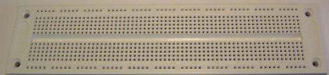
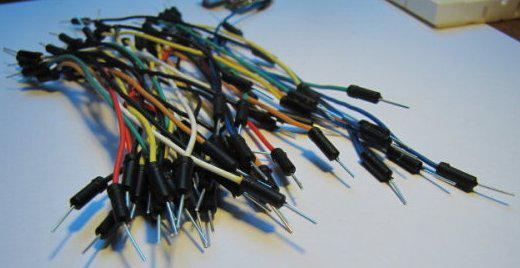

In dit hoofstuk leer je hoe je met behulp van de servo library een servomotor kunt besturen.

## Benodigde onderdelen

|                                       | Item                                | Aantal |
|---------------------------------------|-------------------------------------|--------|
|      | Arduino Uno                         |      1 |
|  | Breadboard                          |      1 |
|          | Breadboard draden                   |     10 |
|            | Servo motor                         |      1 |
|      | Potentiometer (variabele weerstand) |      1 |

# De servo motor

Een servo motor is een motortje met een slim stukje regelelektronica die de motor aanstuurbaar maakt met een positiesignaal in plaats van een snelheidssignaal. Dit betekent dat je een servomotor aanstuurt door een positie naar de motor te sturen. Met Arduino is dit positiesignaal eenvouding te genereren, met behulp van de servo library.

Het aansluiten van een kleine servomotor kan heel eenvoudig: maak de `rode` draad vast aan de `5v` aansluiting, de `zwarte` draad aan `GND` en de `gele` draad aan een digitale uitgang.


Om de servo library te kunnen gebruiken in ons programma moeten we de library eerst toevoegen aan ons programma. Dit kan met het `#include` commando. In dit geval willen we de servo library toevoegen, dat doen we met `#include <Servo.h>`.

Daarna moeten we een object maken. Een `object` is een `instance` van een `class`. Hoewel de details achter deze begrippen meer thuis horen in een cursus "object georiënteerd programmeren" kunnen we het gebruik binnen de Arduino omgeving terugbrengen naar: je maakt een kopie van de library voor iedere servomotor die je aansluit.

In ons geval willen we 1 servo aansturen. We noemen de servo `myservo`. Het maken van het object doen we door `Servo myservo;` toe te voegen aan het programma.

De laaste stap is het toewijzen van een pinnummer aan het servo object. In ons geval zit de servomotor vast aan pin 11. We vertellen dit aan het object met behulp van de `attach` functie: `myservo.attach(11);`. Het toewijzen van een pin hoeft maar één keer gedaan te worden. We plaatsen het commando daarom in de `setup()` functie.

De meeste servomotoren hebben een bereik van 180 graden. Het daadwerkelijk aansturen van de servomotor zo simpel als het aanroepen van de `write(<hoek>);` functie van het servo object: `myservo.write(90);` zet de servomotor op een hoek van 90 graden, in het midden van het bereik dus.

Een simpel voorbeeldprogramma dat de servomotor beweegt komt er als volgt uit te zien:

```
#include <Servo.h> 

Servo myservo;
 
void setup() 
{ 
  myservo.attach(11);
} 

void loop() {
    myservo.write(0);
    delay(900);
    myservo.write(90);
    delay(900);
    myservo.write(180);
    delay(900);
}
```

Dit programma laat het servomotortje draaien van van 0 tot 90 graden, waarna het even wacht om vervolgens door te draaien naar 180 graden. Na nogmaals gewacht te hebben keert het programma de serovomotor terug naar 0 graden.

# Besturing met behulp van een variabele weerstand

Als je naast de servomotor het schema met de variabele weerstand van het vorige hoofdstuk opbouwt kan je door aan de variabele weerstand te draaien de positie van de servomotor aanpassen.


Het programma om de variabele weerstand aan de servomotor te koppelen is als volgt:

```
#include <Servo.h> 

Servo myservo;
 
void setup() { 
  Serial.begin(9600);
  myservo.attach(11);
} 

void loop() {
  int value = analogRead(A0);
  int pos = map(value, 0, 1023, 0, 180);
  myservo.write(pos);
  Serial.print("waarde potmeter = ");
  Serial.print(value);
  Serial.print(", positie servo = ");
  Serial.println(pos);
  delay(10);
}
```

De meeste functies uit het bovenstaande programma heb je al eens gezien. In Les 2 hebben we de seriële poort gebruikt en een analoge ingang uitgelezen. Als we de waarde (van 0 tot en met 1023) die we van de analoge ingang willen lezen willen gebruiken om een servomotor met een bereik van 0 tot 180 aan te sturen moeten we de ontvangen waarden schalen naar het bereik van de servomotor.

Dit schalen kan met de `int uit = map(<in>, <minimale waarde in>, <maximale waarde in>, <minimale waarde uit>, <maximale waarde uit>);` functie. In ons geval wordt het dus `int pos = map(value, 0, 1023, 0, 180);`.
