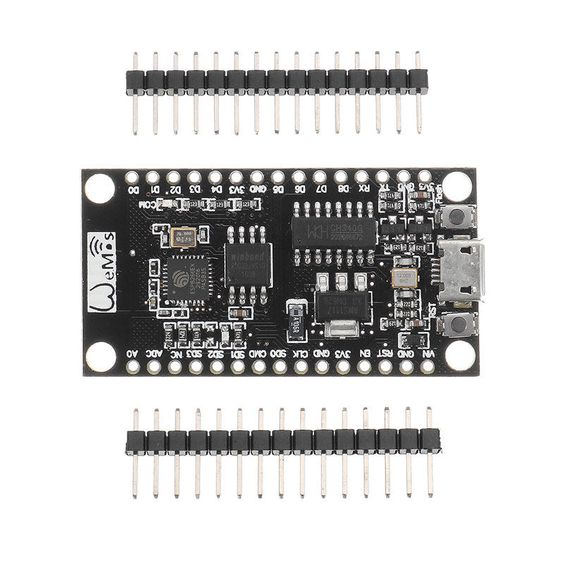

## Benodigde onderdelen

|                                                   | Item              | Aantal |
|---------------------------------------------------|-------------------|--------|
|   | Wemos nodeMCU     |      1 |
|                 | Weerstand 1000Ω   |      1 |
|               | Breadboard        |      1 |
|                       | Breadboard draden |      2 |

# De hardware

We gebruiken in onze workshop de Wemos NodeMCU maar er zijn vele alternatieve boards beschikbaar om met domotica projecten aan de slag te gaan.

Meestal wil je bijvoorbeeld met je webbrowser een schakelaar aan of uit zetten, dit kan via IoT processor board zoals de nodeMCU. 

## Domotica en veiligheid
Zolang je domotica alleen beschikbaar zijn in je eigen netwerk hoef je niet al te veel zorgen te maken over beveiliging, maar als deze voor de hele wereld te bereiken is moet je deze wel goed beveiligen. Dit wil dus zeggen dat iedereen hier bij kan en ook een poging kan wagen om je device te hacken, met alle gevolgen van dien. Er zijn genoeg gevallen bekend dat via de web camera of NEST thermostaat een netwerk word binnen gedrongen. 
We besteden hier geen specifieke aandacht aan in onze workshop maar wees hier bewust van. 

### nodeMCU met ESP8266
De ESP is een wifi chip ontwikkeld door Espressif en erg populair in IoT projecten. In deze chip zit een microprocessor met een Wifi functionaliteit die je op de Arduino manier kunt programmeren. In onze cursus gebruiken we de 'Wemos nodeMCU v3', een ‘developer’ board met een USB aansluiting (makkelijk voor het programmeren) en een ESP8266 chip.

Je kunt deze nodeMCU programmeren vanuit de vertrouwde Arduino IDE maar hiervoor zul je een aantal hulptools moeten installeren.  Om de tools voor de nodeMCU binnen de Arduino IDE beschikbaar te krijgen moeten we deze hardware toevoegen via de ‘boards manager’. 

### Specificaties
- Memory : 4 Mb
- Processor : ATmega16U2 op 3.3V
- IO : D0 ~ D8, SD1 ~ SD3: used as GPIO, PWM, IIC, (15mA) / AD0: 1 channel ADC
- Wireless : 802.11 b / g / n standard
- Built-in TCP / IP protocol stack to support multiple TCP Client connections (5 MAX)
- Power input: 4.5V ~ 9V (10VMAX), USB powered
- Current: continuous transmission: ≈70mA (200mA MAX), Standby: <200uA
- Transfer rate: 110-460800bps
- Support UART / GPIO data communication interface
- Remote firmware upgrade (OTA)
- Support Smart Link Smart Networking

### Installeren benodigde software
Open binnen de Arduino IDE de voorkeuren / preferences en vul bij  “Additional Board Manager URLs” de waarde “http://arduino.esp8266.com/stable/package_esp8266com_index.json” in. Als je hier al een board hebt ingevuld staan kun je een volgende board toevoegen met een komma en dan de board.
Ga vervolgens naar menu “Tools -> Board” en installeer de “esp8266” platform. Hiermee worden de benodigde extra tools geïnstalleerd in de Arduino IDE.

Door een afwijkende chip van de seriële poort wordt deze door je systeem niet automatisch wordt herkend. Zie hiervoor de webpagina over ['installeren windows driver'](/les-6-domotica-met-de-esp266/installeren-windows-driver/) 

## Programmeren van nodeMCU
Voor de nodeMCU zijn zijn er verschillende methoden om deze te programmeren. Je kunt het via Lua programmeren (script taal) of op de Arduino manier. In deze cursus gaan we de nodeMCU op de Arduino manier programmeren.

### Voorbeelden ander toepassingen voor nodeMCU 
- Gegevens van site halen en deze weergeven (weer, open/dicht status TkkrLab)
‘Webserver’ voor aansturen van bv lampen / LED 
- Gebruik voor de Pin de notatie ‘D1’ voor digitale pin 1. (alleen nummer kan verwarring geven)

<image src="images/nodemcu_led_breadboard.jpg" style="width: 600px" alt="nodemcu-led-breadboard"/>

# De Software

We sluiten een LED aan zoals in de eerste led op pin D5. Vervolgens maken we de software die een webpagina maakt en de aansturing van de LEDs regelt.

We gebruiken hier een 'while waarmee we een lus maken dit word uitgevoerd tot de conditie niet meer waar is. In deze programma wachten we dus zolang tot de wifi verbinding is opgebouwd.

Met de `String web=` word een webpagina gemaakt die je kunt zien op de browser kunt zien. Om een webpagina te maken moet je specifieke layout gebruiken zoals <tags> e.d. Als je meer over HTML wil weten check dan  [w3school] (https://www.w3schools.com/html/default.asp).


```
#include <ESP8266WiFi.h> //include de libery voor wifi functionaliteit

#define LED D5 //PIN waaraan led is aangesloten

//logingevens voor de wifi
const char* ssid = "www.tkkrlab.nl";
const char* password = "PASSWORD"; //Wijzigen naar wachtwoord!!

unsigned char status_led=0; //bewaar huidige status led
WiFiServer server(80); //defineer webserver object op poort 80

void setup() {
  Serial.begin(115200);
  pinMode(LED, OUTPUT); 
  Serial.println();
  Serial.println();
  Serial.print("Connecting to ");
  Serial.println(ssid); //print je wifi ssid
  WiFi.begin(ssid, password); //maak object aan en defineer SSID gegevens

  //wachten tot wifi verbinding is opgebouwd
  while (WiFi.status() != WL_CONNECTED) //probeer connectie te maken, retry als het niet lukt.
  {
    delay(500);
    Serial.print(".");
  }

  Serial.println("");
  Serial.println("WiFi connected");
  server.begin();
  Serial.println("Server started");
  Serial.println(WiFi.localIP()); //Geef gekregen IP adres terug
}

void loop() {
  WiFiClient client = server.available(); //check of er een webrequest is
  if (!client) { //Indien geen data einde loop
    return; 
  }
  
  Serial.println("new client");
  while(!client.available())
  {
    delay(1);
  }

  String req = client.readStringUntil('\r');
  Serial.println(req);
  client.flush();
  if (req.indexOf("/ledoff") != -1) //url ledoff
  {
    status_led=0;   
    digitalWrite(LED,LOW);
    Serial.println("LED OFF");
  }
  else if(req.indexOf("/ledon") != -1)
  {
    status_led=1;
    digitalWrite(LED,HIGH);
    Serial.println("LED ON");
  }

  //Maak respons + HTML pagina
  String web = "HTTP/1.1 200 OK\r\nContent-Type: text/html\r\n\r\n";
  web += "<html>\r\n";
  web += "<body>\r\n";
  web += "<h1>LED Status</h1>\r\n";
  web += "<p>\r\n";
  if(status_led==1)
      web += "LED On\r\n";
  else
      web += "LED Off\r\n";
  web += "</p>\r\n";
  web += "</p>\r\n";
  web += "<a href=\"/ledon\">\r\n";
  web += "<button>LED On</button >\r\n";
  web += "</a>\r\n";
  web += "</p>\r\n";
  
  web += "<a href=\"/ledoff\">\r\n";
  web += "<button>LED Off</button >\r\n";
  web += "</a>\r\n";
  
  web += "</body>\r\n";
  web += "</html>\r\n";
  
  client.print(web);
}
```

## Voorbeeld met web form
Je kunt met html forms ook waarden naar je webserver sturen. Deze kun je dan gebruiken voor het aansturen van hardware. In dit voorbeeld kun je naam ingeven en deze word dan ook gebruikt voor het weergeven van de website.

Hieronder vind je sourcecode voorbeeld van een webform.

```
#include <ESP8266WiFi.h>

#define LED D5 //PIN waaraan led is aangesloten

//logingevens voor de wifi
const char* ssid = "www.tkkrlab.nl";
const char* password = "PASSWORD"; //

unsigned char status_led = 0;
WiFiServer server(80); //defineer webserver op poort 80

void setup() {
  Serial.begin(115200);
  pinMode(LED, OUTPUT);
  Serial.println();
  Serial.println();
  Serial.print("Connecting to ");
  Serial.println(ssid);
  WiFi.begin(ssid, password); //defineer SSID gegevens
  while (WiFi.status() != WL_CONNECTED) //probeer connectie te maken
  {
    delay(500);
    Serial.print(".");
  }
  Serial.println("");
  Serial.println("WiFi connected");
  server.begin();
  Serial.println("Server started");
  Serial.println(WiFi.localIP()); //Geef gekregen IP adres terug
}

void loop() {
  WiFiClient client = server.available();
  if (!client) { //check of er een webrequest is
    return;
  }

  Serial.println("new client");
  while (!client.available())
  {
    delay(1);
  }
  String req = client.readStringUntil('\r');
  Serial.println(req);
  client.flush();
  
  if (req.indexOf("/ledoff") != -1)
  {
    status_led = 0;
    digitalWrite(LED, LOW);
    Serial.println("LED OFF");
  }
  else if (req.indexOf("/ledon") != -1)
  {
    status_led = 1;
    digitalWrite(LED, HIGH);
    Serial.println("LED ON");
  }

  String firstname = "" ;
  if (req.indexOf("firstname") != -1) {
    firstname = req.substring(req.indexOf("firstname")+10,req.indexOf("lastname")-1);
    Serial.print("WEB Firstname : ");
    Serial.println(firstname);
  }
  
  //Maak respons + HTML pagina
  String web = "HTTP/1.1 200 OK\r\nContent-Type: text/html\r\n\r\n";
  web += "<html>\r\n";
  web += "<body>\r\n";
  web += "<h1>LED Status</h1>\r\n";
  
  if (firstname != "") {
   web += "<h2>Hallo "+firstname+"</h2>\r\n";
  }
  
  web += "<p>\r\n";
  if (status_led == 1)
    web += "LED On\r\n";
  else
    web += "LED Off\r\n";
    
  web += "</p>\r\n";
  web += "</p>\r\n";
  web += "<a href=\"/ledon\">\r\n";
  web += "<button>LED On</button >\r\n";
  web += "</a>\r\n";
  web += "</p>\r\n";

  web += "<a href=\"/ledoff\">\r\n";
  web += "<button>LED Off</button >\r\n";
  web += "</a>\r\n";
  
  web += "<br><br><form method='get'>";
  web += "First name:<br><input type='text' name='firstname'><br>";
  web += "Last name:<br><input type='text' name='lastname'><br>";
  web += "<input type='submit' value='Submit'>";
  web += "</form>";

  web += "</body>\r\n";
  web += "</html>\r\n";

  client.print(web);
}
```


