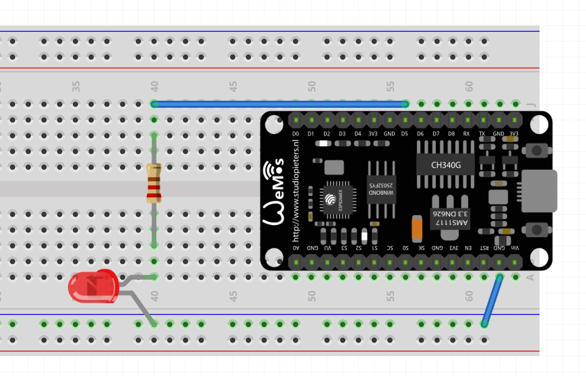

## Benodigde onderdelen

|                                                   | Item              | Aantal |
|---------------------------------------------------|-------------------|--------|
|   | Wemos nodeMCU     |      1 |
|                 | Weerstand 1000Ω   |      1 |
|               | Breadboard        |      1 |
|                       | Breadboard draden |      2 |

# De hardware

We gebruiken in deze workshop de Wemos NodeMCU, een Arduino bordje gebaseerd op de ESP8266 microcontroller van Espressif.
Nast het Wemos bordje dat we tijdens de workshop gebruiken zijn vele alternatieve bordjes beschikbaar om met domotica projecten aan de slag te gaan.

Door de WiFi verbinding die het bordje dat we in dit onderdeel gebruiken heeft is het mogelijk om je eigen Internet of Things (IoT) apparaat te maken.

Tijdens dit onderdeel van de workshop leren we je hoe je vanuit de webbrowser op je computer of telefoon een LED aan en uit kunt zetten. In het menu zijn ook uitgebreidere onderwerpen te vinden zoals het gebruik van Arduino in combinatie met MQTT en met de Athom Homey.

### nodeMCU met ESP8266
De ESP is een chip ontwikkeld door Espressif en erg populair voor IoT projecten. In de chip zit een microprocessor met een WiFi radio die je met de Arduino IDE kunt programmeren. In onze cursus gebruiken we de 'Wemos nodeMCU v3', een ‘developer’ board met een USB aansluiting (makkelijk voor het programmeren) en een ESP8266 chip.

Je kunt deze NodeMCU programmeren vanuit de vertrouwde Arduino IDE maar hiervoor zul je een aantal hulptools moeten installeren.  Om de tools voor de nodeMCU binnen de Arduino IDE beschikbaar te krijgen moeten we deze hardware toevoegen via de ‘boards manager’. 

### Installeren benodigde software
Open binnen de Arduino IDE het menu `Bestand` (`Files`) > `Voorkeuren` (`Preferences`) en vul bij  “Additional Board Manager URLs” de URL “http://arduino.esp8266.com/stable/package_esp8266com_index.json” in. Als je hier al een board hebt ingevuld staan kun je een volgende board toevoegen met een komma en dan de board.

Ga vervolgens naar het menu `Tools` > `Board` en installeer het `ESP8266` platform. Hiermee worden de benodigde extra tools geïnstalleerd in de Arduino IDE.

Als de chip voor seriële communicatie op het NodeMCU bordje niet automatisch wordt herkend door Windows moet je het stuurpgramma installeren. Zie hiervoor de pagina ['CH340 driver installatie'](driver/) .

## Programmeren van NodeMCU
Voor de nodeMCU zijn zijn er verschillende methoden om deze te programmeren. Je kunt het via Lua programmeren (script taal) of op de Arduino manier. In deze cursus gaan we de nodeMCU op de Arduino manier programmeren.

### Voorbeelden ander toepassingen voor NodeMCU 
- Gegevens van site halen en deze weergeven (weer, open/dicht status TkkrLab)
‘Webserver’ voor aansturen van bv lampen / LED 
- Gebruik voor de Pin de notatie ‘D1’ voor digitale pin 1. (alleen nummer kan verwarring geven)



# De Software

We sluiten een LED aan zoals in de hoofdstuk 1 van de workshop, alleen gebruiken we in dit voorbeeld pin D5. Vervolgens maken we software die een webpagina kan laten zien en de aansturing van de LEDs regelt.

We gebruiken hier een `while loop`. Een while loop is een lus die wordt uitgevoerd zolang de opgegeven conditie waar is. 

In het programma wachten we tot de wifi verbinding is opgebouwd.

We gebruiken hier ook de String object, deze heeft een aantal functies die het eenvoudiger maakt om hier mee te werken. Functie die we in de programmatuur gebruiken is `zoekinstring.indexOf("zoeknaar")` deze geeft de positie waar deze is gevonden en de `zoekinstring` of -1 indien deze niet is gevonden.
Met de methode `zoekinstring.substring(3,4)` geeft een stukje van de string terug vanaf positie 3 en 4 tekens lang. Voor meer string methoden zie de [Arduino Reference] (https://www.arduino.cc/reference/en/language/variables/data-types/stringobject/)

Met de `String web=` word een webpagina gemaakt die je kunt zien op de browser kunt zien. Om een webpagina te maken moet je specifieke layout gebruiken zoals <tags> e.d. Als je meer over HTML wil weten check dan  [w3school] (https://www.w3schools.com/html/default.asp).


```
#include <ESP8266WiFi.h> //include de libery voor wifi functionaliteit

#define LED D5 //PIN waaraan led is aangesloten

//logingevens voor de wifi
const char* ssid = "www.tkkrlab.nl";
const char* password = "PASSWORD"; //Wijzigen naar wachtwoord!!

unsigned char status_led=0; //bewaar huidige status led
WiFiServer server(80); //defineer webserver object op poort 80

void setup() {
  Serial.begin(115200);
  pinMode(LED, OUTPUT); 
  Serial.println();
  Serial.println();
  Serial.print("Connecting to ");
  Serial.println(ssid); //print je wifi ssid
  WiFi.begin(ssid, password); //maak object aan en defineer SSID gegevens

  //wachten tot wifi verbinding is opgebouwd
  while (WiFi.status() != WL_CONNECTED) //probeer connectie te maken, retry als het niet lukt.
  {
    delay(500);
    Serial.print(".");
  }

  Serial.println("");
  Serial.println("WiFi connected");
  server.begin();
  Serial.println("Server started");
  Serial.println(WiFi.localIP()); //Geef gekregen IP adres terug
}

void loop() {
  WiFiClient client = server.available(); //check of er een webrequest is
  if (!client) { //Indien geen data einde loop
    return; 
  }
  
  Serial.println("new client");
  while(!client.available())
  {
    delay(1);
  }

  String req = client.readStringUntil('\r');
  Serial.println(req);
  client.flush();
  if (req.indexOf("/ledoff") != -1) //url ledoff
  {
    status_led=0;   
    digitalWrite(LED,LOW);
    Serial.println("LED OFF");
  }
  else if(req.indexOf("/ledon") != -1)
  {
    status_led=1;
    digitalWrite(LED,HIGH);
    Serial.println("LED ON");
  }

  //Maak respons + HTML pagina
  String web = "HTTP/1.1 200 OK\r\nContent-Type: text/html\r\n\r\n";
  web += "<html>\r\n";
  web += "<body>\r\n";
  web += "<h1>LED Status</h1>\r\n";
  web += "<p>\r\n";
  if(status_led==1)
      web += "LED On\r\n";
  else
      web += "LED Off\r\n";
  web += "</p>\r\n";
  web += "</p>\r\n";
  web += "<a href=\"/ledon\">\r\n";
  web += "<button>LED On</button >\r\n";
  web += "</a>\r\n";
  web += "</p>\r\n";
  
  web += "<a href=\"/ledoff\">\r\n";
  web += "<button>LED Off</button >\r\n";
  web += "</a>\r\n";
  
  web += "</body>\r\n";
  web += "</html>\r\n";
  
  client.print(web);
}
```

## Voorbeeld met web form
Je kunt met html forms ook waarden naar je webserver sturen. Deze kun je dan gebruiken voor het aansturen van hardware. In dit voorbeeld kun je naam ingeven en deze word dan ook gebruikt voor het weergeven van de website.

Hieronder vind je sourcecode voorbeeld van een webform.

```
#include <ESP8266WiFi.h>

#define LED D5 //PIN waaraan led is aangesloten

//logingevens voor de wifi
const char* ssid = "www.tkkrlab.nl";
const char* password = "PASSWORD"; //

unsigned char status_led = 0;
WiFiServer server(80); //defineer webserver op poort 80

void setup() {
  Serial.begin(115200);
  pinMode(LED, OUTPUT);
  Serial.println();
  Serial.println();
  Serial.print("Connecting to ");
  Serial.println(ssid);
  WiFi.begin(ssid, password); //defineer SSID gegevens
  while (WiFi.status() != WL_CONNECTED) //probeer connectie te maken
  {
    delay(500);
    Serial.print(".");
  }
  Serial.println("");
  Serial.println("WiFi connected");
  server.begin();
  Serial.println("Server started");
  Serial.println(WiFi.localIP()); //Geef gekregen IP adres terug
}

void loop() {
  WiFiClient client = server.available();
  if (!client) { //check of er een webrequest is
    return;
  }

  Serial.println("new client");
  while (!client.available())
  {
    delay(1);
  }
  String req = client.readStringUntil('\r');
  Serial.println(req);
  client.flush();
  
  if (req.indexOf("/ledoff") != -1)
  {
    status_led = 0;
    digitalWrite(LED, LOW);
    Serial.println("LED OFF");
  }
  else if (req.indexOf("/ledon") != -1)
  {
    status_led = 1;
    digitalWrite(LED, HIGH);
    Serial.println("LED ON");
  }

  String firstname = "" ;
  if (req.indexOf("firstname") != -1) {
    firstname = req.substring(req.indexOf("firstname")+10,req.indexOf("lastname")-1);
    Serial.print("WEB Firstname : ");
    Serial.println(firstname);
  }
  
  //Maak respons + HTML pagina
  String web = "HTTP/1.1 200 OK\r\nContent-Type: text/html\r\n\r\n";
  web += "<html>\r\n";
  web += "<body>\r\n";
  web += "<h1>LED Status</h1>\r\n";
  
  if (firstname != "") {
   web += "<h2>Hallo "+firstname+"</h2>\r\n";
  }
  
  web += "<p>\r\n";
  if (status_led == 1)
    web += "LED On\r\n";
  else
    web += "LED Off\r\n";
    
  web += "</p>\r\n";
  web += "</p>\r\n";
  web += "<a href=\"/ledon\">\r\n";
  web += "<button>LED On</button >\r\n";
  web += "</a>\r\n";
  web += "</p>\r\n";

  web += "<a href=\"/ledoff\">\r\n";
  web += "<button>LED Off</button >\r\n";
  web += "</a>\r\n";
  
  web += "<br><br><form method='get'>";
  web += "First name:<br><input type='text' name='firstname'><br>";
  web += "Last name:<br><input type='text' name='lastname'><br>";
  web += "<input type='submit' value='Submit'>";
  web += "</form>";

  web += "</body>\r\n";
  web += "</html>\r\n";

  client.print(web);
}
```
## IoT en veiligheid
In dit onderdeel van de workshop verbinden we Arduinos met WiFi en dus met het internet. Zolang je creaties alleen bereikbaar zijn vanuit je eigen netwerk hoef je niet al te veel zorgen te maken over beveiliging, maar als je creatie voor de hele wereld te bereiken is moet je deze wel goed beveiligen. We besteden aan beveiliging in deze workshop geen specifieke aandacht, maar wees je bewust van mogelijke risicos.
