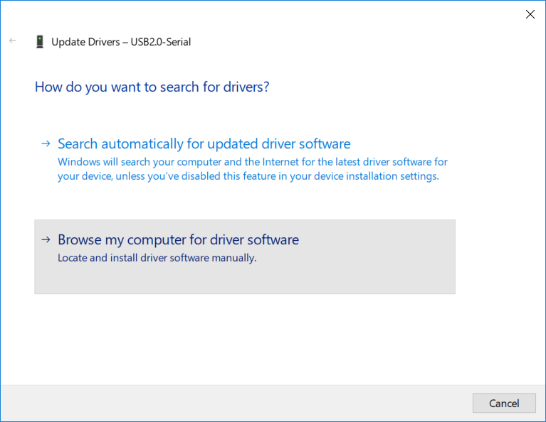

---
title: "CH340 driver installatie"
date: 2018-05-11
weight: 30
--- 

### Download het stuurprogramma

Stap 1 is het downloaden van het stuurprogramma. Wij hebben het stuurprogramma alvast voor je opgezocht.

[Klik hier om het stuurprogramma te downloaden](/drivers/ch340.zip)

Het driverpakket bestaat uit meerdere bestanden die we hebben gecomprimeerd als een zip archief.
Nadat u het bestand heeft gedownload moet het bestand worden uitgepakt. Dat doe je zo:

### Installatie van het stuurprogramma

Stap 1 is het openen van het "Apparaatbeheer" ("Device manager"). Dat kan je doen door met de rechtermuisknop op de startknop te klikken en "Apparaatbeheer" te kiezen.

Je krijgt dan het volgende scherm te zien:

Bij "Overige apparaten" ("Other devices") zul je "USB2.0-Serial" zien staan. Klik daar op met de rechtermuisknop en kies "Stuurprogramma bijwerken..." ("Update driver..."). Je krijgt dan het volgende scherm te zien:

Kies de optie "Zoeken op mijn computer" ("Browse my computer for driver software").

Druk vervolgens op "Bladeren..." ("Browse...") en kies de "ch340" map waarnaar je het zipbestand hebt uitgepakt.

Klik op "OK" en doorloop de rest van de stappen door op volgende te klikken.

Wanneer het stuurprogramma geinstalleerd is zal de devicemanager het apparaat herkennen en een COM nummer toewijzen. Dat is het poortnummer dat je in de Arduino kunt gebruiken.
