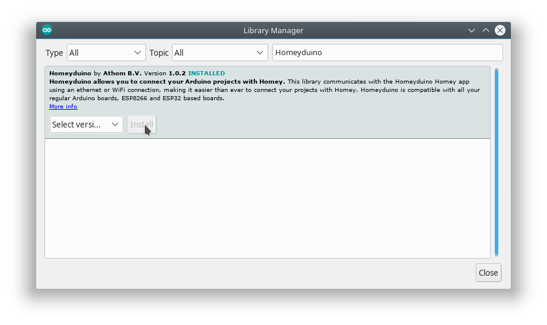

De [Homey van Athom](https://www.athom.com/nl/) is een centrale hub voor een slim huis. Homey kan vrijwel alle slimme apparaten die nu op de markt zijn aansturen en uitlezen met zijn ingebouwde radios voor onder andere Z-Wave, Zigbee, Infrarood en 433MHz. De Homey zelf kan je programmeren met behulp van flows. Een flow is een klein programmatje bestaande uit een verzameling kaartjes welke een `gebeurtenis`, `conditie` of `actie` vertegenwoordigen.

Tijdens zijn stage bij Athom heeft Tkkrlab deelnemer Renze een systeem gebouwd waarmee Homey kan samenwerken met je eigen Arduino projecten. Dat systeem heet [Homeyduino](https://github.com/athombv/com.athom.homeyduino) en werkt samen met zowel ESP8266 gebaseerde borden als borden met een ESP32 of Arduino Ethernet shield.

Op je Homey apparaat kan je de [Homeyduino app](https://apps.athom.com/app/com.athom.homeyduino) installeren vanuit de [applicatiewinkel](https://apps.athom.com/app/com.athom.homeyduino).

In de Arduino library manager kan je de Homeyduino Arduino library vinden. Meer informatie over de Homeyduino Arduino library vind je op de [Github pagina van het project]().

De Arduino library manager kan je vinden in het menu onder `Sketch` > `Include Library` > `Manage Libraries...`.

### Voorbeelden
In het menu vind je vier voorbeeldprojecten die de mogelijkheden van Homeyduino laten zien: een [automatische plantenbak](plantenbak/), een [DHT11 temperatuur en luchtvochtigheidssensor](dht11/), een [NFC lezer](nfc/) en een [Simon says spel](simon-says/).
