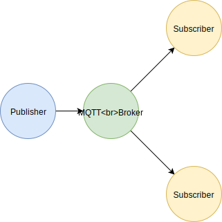
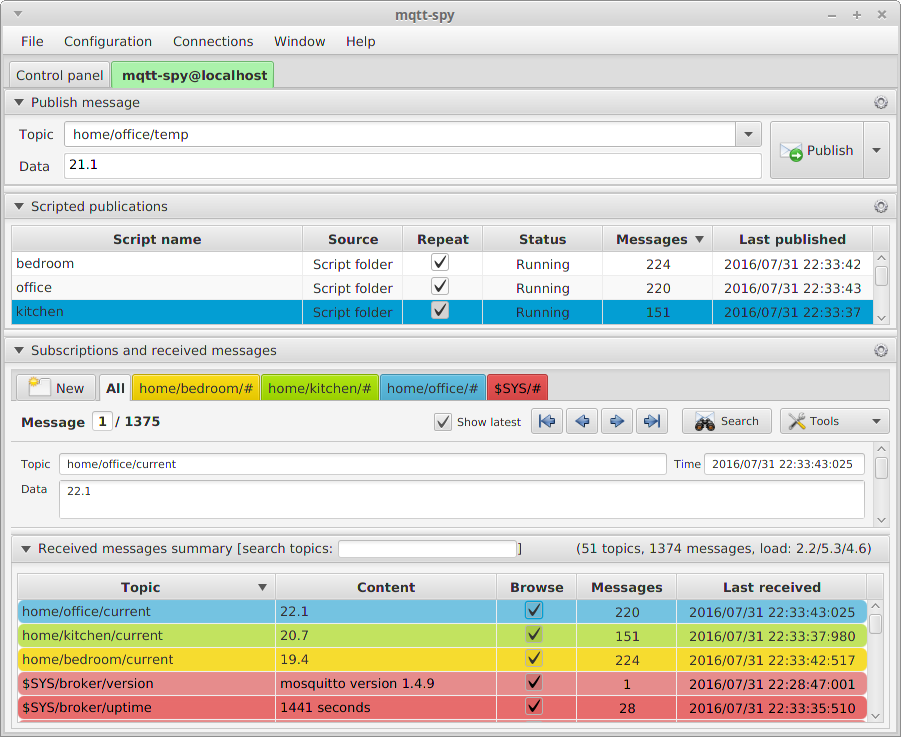
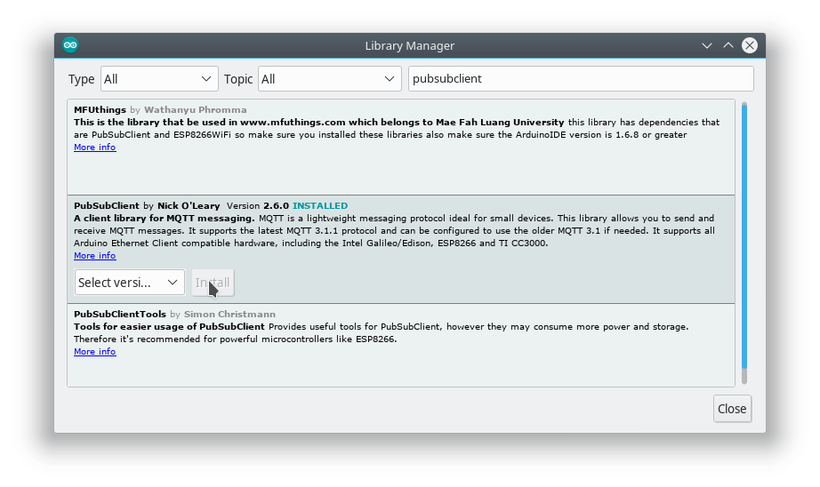
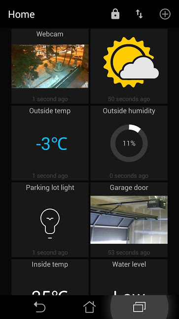

MQTT, wat staat voor "Message Queuing Telemetry Transport" is een protocol dat faciliteert in het ontvangen en versturen van berichten tussen verschillende IoT apparaten en applicaties.

Een MQTT server, ook wel broker genoemd, stuurt berichten die naar de broker toegezonden worden door naar alle verbonden clients die geabonneerd zijn op het soort bericht dat werd ontvangen.

Een bericht in MQTT bestaat uit een onderwerp ("topic") en inhoud ("payload"). Berichten die naar de broker worden verzonden worden worden doorgestuurd naar alle verbonden clients die een abonnement hebben op het topic.



Een voorbeeld van een situatie waarin MQTT kan worden gebruikt is wanneer je meerdere bedieningselementen, bijvoorbeeld een tablet en een telefoon wilt kunnen gebruiken om een lamp te schakelen. De lamp luistert op een topic, bijvoorbeeld "lamp". Zowel het tablet als de telefoon zijn ook geabonneerd op het topic "lamp" zodat ook zij veranderingen in de staat van de lamp zullen ontvangen. Daarnaast kunnen het tablet en de telefoon een nieuwe staat publiceren. Zodra de gebruiker op de telefoon de lamp op AAN zet zal de telefoon een bericht versturen naar de MQTT broker met als onderwerp "lamp" en als inhoud "aan". Zowel de lamp als het tablet zullen het bericht ontvangen en hun staat aanpassen.

# MQTT broker

Om MQTT te kunnen gebruiken heb je een broker nodig. Je kunt gebruik maken van een publieke MQTT broker of zelf een broker opzetten.

### Publieke MQTT brokers

Voor je eerste tests kan je gebruik maken van een publieke MQTT broker.

Een aantal voorbeelden van publieke MQTT brokers zijn:

 - test.mosquitto.org
 - broker.hivemq.com
 - mqtt.swifitch.cz
 
Tkkrlab heeft ook een MQTT broker, op het adres "mqtt.tkkrlab.nl".

### Zelf een MQTT broker installeren

Wij raden de Mosquitto MQTT broker aan. Mosquitto is gratis en open-source software. Je kunt Mosquitto [hier](https://mosquitto.org/download/) downloaden. Meer informatie over Mosquitto kan je vinden op [mosquitto.org](https://mosquitto.org/).

# MQTT clients voor de computer

Bij de Mosquitto MQTT broker worden twee hulpprogrammas meegeleverd: `moqsuitto_pub` en `mosquitto_sub`. Met deze tools kan je tests uitvoeren:

Het volgende commando verbind met de MQTT broker en vraagt een abonnement aan op het onderwerp "test". Het zal de inhoud van alle ontvangen berichten printen naar het scherm.

```
mosquitto_sub -h mqtt.tkkrlab.nl -t "test"
```

Om een bericht te versturen kan je `mosquitto_pub` gebruiken:

```
mosquitto_pub -h mqtt.tkkrlab.nl -t "test" -m "hello world"
```

Naast de commandline hulpprogrammas zijn er ook hulpprogrammas met een GUI, bijvoorbeeld `mqtt-spy`. 



MQTT-spy kan je [hier](https://github.com/eclipse/paho.mqtt-spy/wiki/Downloads) downloaden. Meer informatie over het programma vind je [hier](https://github.com/eclipse/paho.mqtt-spy/wiki/GettingStarted).

# MQTT met Arduino

Ook voor Arduino zijn meerdere MQTT clients te vinden, bijvoorbeeld [PubSubClient](https://github.com/knolleary/pubsubclient) en [Adafruits MQTT library](https://github.com/adafruit/Adafruit_MQTT_Library). Beide zijn gemakkelijk te installeren via de Arduino library manager. Deze kan je vinden in het menu onder `Sketch` > `Include Library` > `Manage Libraries...`.



De volgende voorbeelden demonstreren hoe je `PubSubClient` kunt gebruiken op een `ESP8266` gebaseerd bord. De library is ook te gebruiken in combinatie met het `Arduino Ethernet shield` en borden gebaseerd op de `ESP32` microcontroller. Om de voorbeelden daarop te kunnen gebruiken zijn wel enkele aanpassingen nodig.

### Voorbeeld

```
#include <ESP8266WiFi.h>
#include <PubSubClient.h>

WiFiClient espClient;
PubSubClient client(espClient);

unsigned long previousMillis = 0;
const long interval = 1000;

void callback(char* topic, byte* payload, unsigned int length) {
  Serial.print("Message arrived [");
  Serial.print(topic);
  Serial.print("] ");
  for (int i=0;i<length;i++) {
    Serial.print((char)payload[i]);
  }
  Serial.println();
}

void setup() {
  Serial.begin(115200);
  
  WiFi.mode(WIFI_STA);
  WiFi.begin("ssid", "wachtwoord");
  WiFi.hostname("test-apparaat");
  
  client.setServer("mqtt.tkkrlab.nl", 1883);
  client.setCallback(callback);
}

void loop() {
  if (WiFi.status() != WL_CONNECTED) {
    //Niet verbonden met het netwerk...
    Serial.println("Wachten op WiFi...");
    delay(100);
  } else {
    //Verbonden met het netwerk.
    if (!client.connected()) {
      //Nog niet verbonden met de MQTT broker
      Serial.println(F("Wifi connected! Connecting to MQTT server..."));
      if (client.connect("uniekeNaamVoorDeClient")) {
        Serial.println("MQTT connected!");
        setInternalLed(true);
        client.subscribe("test");
      } else {
        Serial.print("failed, rc=");
        Serial.print(client.state());
        Serial.println(" (waiting 5 seconds before trying again...)");
        delay(5000);
      }
    } else {
      //Verbonden met de MQTT broker
      unsigned long currentMillis = millis();
      if (currentMillis - previousMillis >= interval) {
        previousMillis = currentMillis;
        client.publish("test", "hello world");
        client.publish("millis", String(currentMillis));
      }
    }
  }
}
```

Je ziet dat we de `PubSubClient` library toevoegen aan onze sketch met het `#include <PubSubClient.h>` commando en dat we een MQTT client maken door een object te maken. Omdat we toch maar één client maken noemen we de client `client`.

Eerst verbinden we met de WiFi met de standaard commandos voor de ESP8266 WiFi radio. Daarna vertellen we de client waar de MQTT broker te vinden is met het commando `client.setServer(<hostname>, <port>)`. Voor de Tkkrlab MQTT broker is de hostname `mqtt.tkkrlab.nl` en de poort `1883`.

Wanneer de client een bericht ontvangt van de broker kan het een functie aanroepen. De functie die aangeroepen moet worden kan je doorgeven aan de client met het `client.setCallback(<functie>);` commando. In ons geval heet de callback functie `callback`.

Verbinden met een MQTT client doe je met het commando `client.connect("id");`, waarin "id" een unieke naam is voor het apparaat. Eventueel kan je ook inloggen op de MQTT server door niet alleen de id mee te geven maar ook een gebruikersnaam en wachtwoord: `client.connect("id", "gebruikersnaam", "wachtwoord");`.

# MQTT op Android

In het Tkkrlab gebruiken wij een Android tablet met de [MQTT Dash](https://play.google.com/store/apps/details?id=net.routix.mqttdash&hl=nl) app om onze IoT apparaten aan te sturen. De app is gratis maar helaas niet open-source.



# Hints

 - Om in één keer te abonneren op meer dan 1 topic kan je de wildcard `#` gebruiken in het topic. Een abonnement op `#` ontvangt alle berichten op alle onderwerpen en een abonnement op `test/#` ontvangt alle berichten met een onderwerp dat begint met `test/`. Bijvoorbeeld `test/abc` of `test/qwerty`.
 
 - Het is mogelijk om een bericht te bewaren op de server. Zodra een client zich abonneert op het onderwerp zal het meteen het laatst bewaarde bericht toegestuurd krijgen. Je kunt de server vertellen dat een bericht bewaard moet worden door de `retained` flag aan te zetten.
 
 
