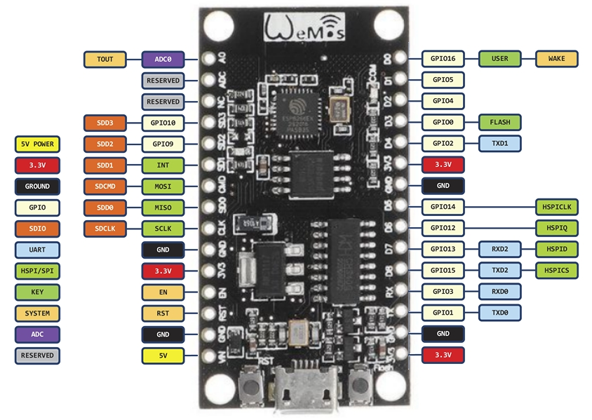

### Informatie

Het NodeMCU bord is gebaseerd op een ESP8266 microcontroller van Espressif. De microcontroller heeft een snelheid van 80MHz en heeft een ingebouwde WiFi radio.

Het NodeMCU bord heeft 9 digitale pinnen en 1 analoge ingang.
De werkspanning is 3.3 volt, minder dan bij de Arduino Uno. Houd daar altijd rekening mee: je mag nooit 5 volt aanbieden op een pin van de ESP8266, daar gaat de chip door kapot.

Een ander belangrijk punt is het bereik van de analoge ingang. De analoge ingang van de ESP8266 microcontroller heeft een meetbereik van 0 tot en met 1 volt.

Je zult een spanningdeler moeten gebruiken wanneer je hogere spanningen (dan 3.3 of 1 volt) wilt kunnen aanbieden op de poorten. Informatie over spanningdelers kan je vinden in het hoofdstuk "Basiskennis elektronica".

### Specificaties
- Memory : 4 Mb
- Processor : ATmega16U2 op 3.3V
- IO : D0 ~ D8, SD1 ~ SD3: used as GPIO, PWM, IIC, (15mA) / AD0: 1 channel ADC
- Wireless : 802.11 b / g / n standard
- Built-in TCP / IP protocol stack to support multiple TCP Client connections (5 MAX)
- Power input: 4.5V ~ 9V (10VMAX), USB powered
- Current: continuous transmission: ≈70mA (200mA MAX), Standby: <200uA
- Transfer rate: 110-460800bps
- Support UART / GPIO data communication interface
- Remote firmware upgrade (OTA)
- Support Smart Link Smart Networking

### Pinout

