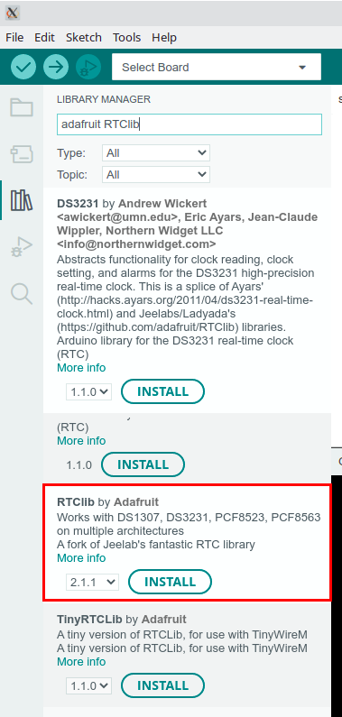

Het data logger shield heeft twee functies dit het makkelijk maken om een data logger van je Arduino te maken. De eerste functie is een SD kaart lezer, waarmee de Arduino de mogelijkheid krijgt zeer veel data op te slaan. De tweede functie is een real-time klok, een chip die met behulp van een kleine batterij de datum & tijd kan onthouden. Daardoor heeft de Arduino altijd de beschikking over de juiste datum & tijd, ook al is de stroom uitgeschakeld geweest..

Zie ook [Adafruit data logger shield](https://learn.adafruit.com/adafruit-data-logger-shield)


## DS1307 Real-time clock

Met behulp van een kleine CR1220 lithium batterij word de tijd ook bijgehouden als de Arduino niet op een voeding aangesloten is. 

De [datasheet](DS1307.pdf) legt in detail uit hoe er met de chip kan worden gecommuniceerd. De chip is met de Arduino verbonden door middel van een `I2C` bus. Gelukkig hoeven we ons niet druk te maken over de exacte werking van de communicatiebus en het protocol maar kunnen we gebruik maken van een library. Een library is een verzameling functies die je heel gemakkelijk kunt invoegen in je Arduino programma door middel van een `#include "..."` regel boven aan het programma.

De DS1307 chip is met de Arduino verbonden via A4 (SDA, serial data) en A5 (SCL, serial clock). Deze pinnen kunnen dus niet meer voor andere functies gebruikt worden. Wel zou je andere devices/chips op kunnen aansluiten die ook communiceren via de [I2C](https://docs.arduino.cc/learn/communication/wire) bus.

### De library installeren
Voor het programma hebben we ook een extra library nodig. We gebruiken hier de 'RTCLib by Adafruit', zoek deze in de Library manager en installeer deze.



### Het programma

Om de library te gebruiken moet deze worden toegevoegd aan het programma. Dit kan worden gedaan door de regel `#include "RTClib.h"` toe te voegen boven in het programma. Om gebruik te maken van de klok worden ook de regels `RTC_DS1307 rtc;` (voor het maken van een object waarmee de staat van de klok wordt gerepresenteerd) en `rtc.begin()` (waarmee de library communicatie met de klok opstart) aan het programma toegevoegd.

```cpp
#include "RTClib.h"

RTC_DS1307 rtc;

void setup() {
  Serial.begin(9600);
  rtc.begin();
}

void loop() {

}
```

Om er zeker van te zijn dat het de library gelukt is om met de klok te communiceren kan een controle worden toegevoegd die kijkt naar het resultaat van de `rtc.begin();` functieaanroep. Deze functie geeft een booleaanse waarde terug, dat is waarde die `waar` (niet 0) of `onwaar` (0) kan zijn. De functie geeft `waar` (niet 0) terug wanneer het communiceren met de klok gelukt is en `onwaar` (0) wanneer het communiceren mislukt is.

In C kan een conditioneel uitgevoerd codeblok worden toegevoegd doormiddel van een `if statement`.

Een if statement bestaat uit een conditie gevolgd door een codeblok binnen accolades.

```cpp
if (conditie) {
  // Code die alleen wordt uitgevoerd als de conditie waar is
}
```

Een conditie is waar wanneer de uitkomst ongelijk is aan `onwaar` (0).

Naast het `if statement` kent C ook een conditioneel uitgevoerde lus, de `while loop`. Een `while loop` voert de code in het codeblok herhaald uit zolang de uitkomst van de conditie `waar` (niet 0) is.

```cpp
while (conditie) {
  // Code die herhaald wordt uitgevoerd zolang de conditie waar is
}
```

Het controleren van het resultaat van de klok initialisatie functie kan als volgt worden geimplementeerd:

```cpp
#include "RTClib.h"

RTC_DS1307 rtc;

void setup() {
  Serial.begin(9600);
  bool communicatieSuccesvol = rtc.begin();
  
  while (communicatieSuccesvol == false) {
    Serial.println("Communicatie met de real-time klok is mislukt!");
    delay(500);
    communicatieSuccesvol = rtc.begin(); // Probeer opnieuw de communicatie met de klok op te starten
  }
}

void loop() {

}
```

Nu we kunnen communiceren met de klok chip is de volgende stap het instellen van de datum en tijd. Dit kan met de `rtc.adjust` functie. Deze functie verwacht als parameter een `DateTime` object. Dit object kan worden gemaakt door 6 parameters mee te geven: jaar, maand, dag, uur, minuut en seconde. Samen ziet dat er bijvoorbeeld zo uit:

```
rtc.adjust(DateTime(2023, 1, 24, 16, 30, 0));
```

We kunnen de klok ook vragen of er al een datum en tijd bekend is, als de klok de datum en tijd niet weet dan staat de klok stil. Dit kan worden gedaan doormiddel van de functie `rtc.isrunning`. Deze functie geeft een booleaans antwoord van `waar` (niet 0) als de klok loopt en `onwaar` (0) als de klok stil staat.

Als we de datum en tijd alleen willen instellen als de klok nog niet gestart is dan kunnen we dat doen door de `rtc.adjust` functie in een conditioneel codeblok (`if statement`) te plaatsen. Dit ziet er als volgt uit:

```cpp
#include "RTClib.h"

RTC_DS1307 rtc;

void setup() {
  Serial.begin(9600);
  bool communicatieSuccesvol = rtc.begin();
  
  while (communicatieSuccesvol == false) {
    Serial.println("Communicatie met de real-time klok is mislukt!");
    delay(500);
    communicatieSuccesvol = rtc.begin(); // Probeer opnieuw de communicatie met de klok op te starten
  }
  
  if (rtc.isrunning() == false) {
    rtc.adjust(DateTime(2023, 1, 24, 16, 30, 0));
    Serial.println("Klok gestart!");
  }
}

void loop() {

}
```

Een leuke truuc om automatisch de juiste datum en tijd in te stellen zonder ingewikkelde code voor communicatie om een datum en tijd in te voeren is het gebruiken van precompiler macros om automatisch de datum en tijd waarop het programma gebouwd is in te vullen in de `rtc.adjust` functie.

Dit kan door de parameters binnen het `DateTime` object dat wordt meegegeven als parameter aan de `rtc.adjust` functie te veranderen in:

```cpp
rtc.adjust(DateTime(F(__DATE__), F(__TIME__)));
```

Gebruik maken van de klok gebeurt doormiddel van de `rtc.now` functie. Deze functie heeft geen parameters en geeft een `DateTime` object terug.

```
DateTime now = rtc.now();
```

Het DateTime object heeft een aantal functies waarmee de velden van de datum en tijd kunnen worden gelezen.

```cpp
DateTime now = rtc.now();
uint16_t year = now.year();
uint8_t month = now.month();
uint8_t day = now.day();
uint8_t hour = now.hour();
uint8_t minute = now.minute();
uint8_t second = now.second();
uint8_t dayOfWeek = now.dayOfTheWeek(); // Dag van de week (0-6) beginnend met zondag
uint32_t timestamp = now.unixtime(); // Aantal seconden sinds middernacht 01-01-1970
```

Het volgende programma print de datum en tijd samen met de gemeten temperatuur naar de computer:

```cpp
#include "RTClib.h"

RTC_DS1307 rtc;

void setup() {
  Serial.begin(9600);
  bool communicatieSuccesvol = rtc.begin();
  
  while (communicatieSuccesvol == false) {
    Serial.println("Communicatie met de real-time klok is mislukt");
    delay(500);
    communicatieSuccesvol = rtc.begin(); // Probeer opnieuw de communicatie met de klok op te starten
  }
  
  if (rtc.isrunning() == false) {
    rtc.adjust(DateTime(2023, 1, 24, 16, 30, 0));
    Serial.println("Klok gestart!");
  }
}

void loop() {
  // Lees de datum en tijd uit
  DateTime now = rtc.now();
  
  // Print het resultaat naar de computer
  Serial.print(now.day(), DEC);
  Serial.print("-");
  Serial.print(now.month(), DEC);
  Serial.print("-");
  Serial.print(now.year(), DEC);
  Serial.print(" ");
  Serial.print(now.hour(), DEC);
  Serial.print(":");
  Serial.print(now.minute(), DEC);
  Serial.print(":");
  Serial.print(now.second(), DEC);
  Serial.print(" ");
  Serial.println(analogTemperature);

  // Wacht
  delay(500);
}
```

## SD kaart

De microcontroller op de Arduino Uno heeft maar zeer beperkt geheugen (1 KB), om toch meer data op te kunnen slaan gebruiken we een externe geheugenkaart, een SD kaart. Deze kaart moet wel geformarteerd zijn met FAT16 filessystem. Let er dan ook op dat een bestandsnaam maximaal 8 tekens voor de punt en 3 na de punt (=extensie) mag hebben.

### Hardware
Voor communicatie met de SD kaart zijn 4 pinnen nodig, op het datalogger shield is de SD kaart aangelosten op pinnen 10 t/m 13:

* pin 10 (CS, chip select)
* pin 11 (DI, data in)
* pin 12 (DO, data uit)
* pin 13 (CLK, klok)

### Software

Om gebruik te kunnen maken van de SD kaart hebben we twee bij de Arduino omgeving meegeleverde libraries nodig: `SPI.h` en `SD.h`.

Je kunt deze libraries toevoegen aan je programma door de volgende regels boven in het programma toe te plakken:

```cpp
#include <SPI.h>
#include <SD.h>
```

De volgende stap is het initialiseren van de communicatie met de SD kaart. Om dat te doen voegen we de volgende initialisatiecode toe aan de `setup` functie:

```cpp
void setup() {
...
  while (SD.begin(10) == false) {
    Serial.println("Communicatie met SD kaart is mislukt");
    delay(500);
  }
}
```

De `SD` kaart library maakt gebruik van de hardwarefuncties voor `SPI` die in de microcontroller zijn ingebouwd. Daarom hoeven we pinnen 11 t/m 13 nergens te specificeren, als `SPI` gebruikt wordt wordt dat altijd via deze pinnen gedaan.

`SPI` staat voor "Serial Peripheral Interface" en is een gestandaardiseerde communicatiebus.

In de loop functie kunnen we nu gebruik maken van de SD kaart doormiddel van de functies `SD.open` om een bestand te maken en/of openen en `exampleFile.write` om naar het bestand te schrijven. Het bestand moet ook weer worden gesloten om de geschreven data daadwerkelijk naar de SD kaart te sturen, dit gebeurt met de functie `exampleFile.close`.

Een voorbeeldprogramma dat de SD kaart initialiseert en iedere seconde een waarde naar een voorbeeldbestand schrijft ziet er als volgt uit:

```cpp
#include <SPI.h>
#include <SD.h>

void setup() {
  Serial.begin(9600);
  while (SD.begin(10) == false) {
    Serial.println("Communicatie met SD kaart is mislukt");
    delay(500);
  }
}

void loop() {
  File exampleFile = SD.open("example.txt", FILE_WRITE);
  if (exampleFile) {
    exampleFile.println("Dit is een test");
    exampleFile.close();
    Serial.println("Testdata succesvol geschreven");
  } else {
    Serial.println("Bestand kon niet worden geopend");
  }
  delay(1000);
}
```

Als we dit programma samenvoegen met de code voor de temperatuursensor en de klok dan krijgen we het volgende:

```cpp
#include "RTClib.h"
#include "SPI.h"
#include "SD.h"

RTC_DS1307 rtc;

void setup() {
  Serial.begin(9600);
  bool communicatieSuccesvol = rtc.begin();
  
  while (communicatieSuccesvol == false) {
    Serial.println("Communicatie met de real-time klok is mislukt");
    delay(500);
    communicatieSuccesvol = rtc.begin(); // Probeer opnieuw de communicatie met de klok op te starten
  }
  
  if (rtc.isrunning() == false) {
    rtc.adjust(DateTime(F(__DATE__), F(__TIME__)));
    Serial.println("Klok gestart!");
  }

  while (SD.begin(10) == false) {
    Serial.println("Communicatie met SD kaart is mislukt");
    delay(500);
  }
}

void loop() {
  // Lees de datum en tijd uit
  DateTime now = rtc.now();
  
  // Print het resultaat naar de computer
  Serial.print(now.day(), DEC);
  Serial.print("-");
  Serial.print(now.month(), DEC);
  Serial.print("-");
  Serial.print(now.year(), DEC);
  Serial.print(" ");
  Serial.print(now.hour(), DEC);
  Serial.print(":");
  Serial.print(now.minute(), DEC);
  Serial.print(":");
  Serial.print(now.second(), DEC);

  // Schrijf data naar een bestand op de geheugenkaart
  File dataFile = SD.open("test.txt", FILE_WRITE);
  if (dataFile) {
    dataFile.print(now.day(), DEC);
    dataFile.print("-");
    dataFile.print(now.month(), DEC);
    dataFile.print("-");
    dataFile.print(now.year(), DEC);
    dataFile.print(" ");
    dataFile.print(now.hour(), DEC);
    dataFile.print(":");
    dataFile.print(now.minute(), DEC);
    dataFile.print(":");
    dataFile.print(now.second(), DEC);
    dataFile.print(" ");
    dataFile.println("Hello world");
    dataFile.close();
  } else {
    Serial.println("Temperatuur opslaan op SD kaart is mislukt, bestand openen mislukt");
  }

  // Wacht
  delay(500);
}
```
