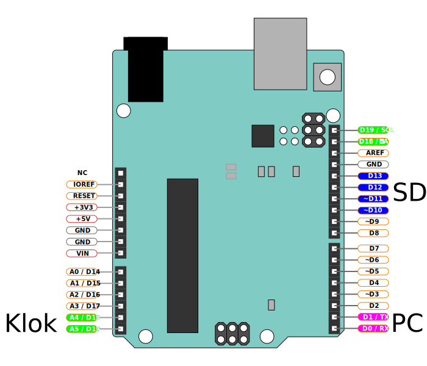
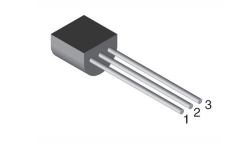
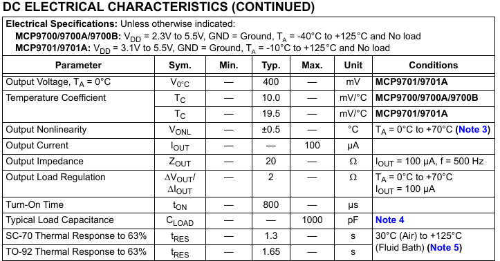

In deze workshop gaan we de temperatuur samen met datum en tijd loggen naar een SD kaart. De presentatie van deze workshop kun je [hier vinden](https://docs.google.com/presentation/d/1XHDRSEYP50TZxLUKir2bVfbAtpUMhwvs52Qhers0uQ8/edit?usp=sharing).

Het data logger shield heeft twee functies dit het makkelijk maken om een data logger van je Arduino te maken. De eerste functie is een SD kaart lezer, waarmee de Arduino de mogelijkheid krijgt zeer veel data op te slaan. De tweede functie is een real-time klok, een chip die met behulp van een kleine batterij de datum & tijd kan onthouden. Daardoor heeft de Arduino altijd de beschikking over de juiste datum & tijd, ook al is de stroom uitgeschakeld geweest. Als temperatuursensor gebruiken we een MCP9701E, dat is een chip die een analoge spanning afgeeft die lineair gerelateerd is aan de gemeten temperatuur.

### Benodigde onderdelen voor deze workshop

* Arduino Uno met USB kabel voor programmeren.
* breadboard met 3 kabeltjes
* Data logger shield met DS1307 real-time klok en SD kaartlezer
* SD kaart
* CR1220 batterij voor de real-time klok
* MCP9701E temperatuur sensor

#### Arduino Uno

Als onderdeel van je workshop kit heb je een Arduino Uno ontvangen. Een Arduino Uno is een bordje gebaseerd op de Atmel ATMEGA328P microcontroller. Een microcontroller is een simpele computer waarbij het geheugen en de processor in een enkele chip samengevoegd zijn. De microcontoller op de Arduino Uno heeft 32KB programmageheugen, 1KB datageheugen en een processor met een snelheid van 16MHz.

De Arduino Uno heeft 13 digitale (aan & uit) aansluitingen die zowel als in- en uitgang kunnen worden ingesteld. Daarnaast heeft de Arduino Uno 6 analoge aansluitingen die naast analoog ook als digitale aansluiting kunnen worden gebruikt. Een deel hiervan wordt gebruikt voor functies op het data logger shield (pinnen 10 t/m 13 voor de SD kaart lezer en A4 en A5 voor de real-time klok) en voor communicatie met de computer (pinnen 0 en 1).



#### Breadboard

In deze les ga je een schakeling opbouwen op een breadboard. Een breadboard bevat gaatjes die in een patroon met elkaar verbonden zijn, waardoor je elektrische verbindingen kunt maken tussen de verschillende componenten die je er in plaatst.

De gaatjes van een breadboard zijn op de volgende manier met elkaar verbonden:


De zwarte lijntjes worden meestal gebruikt om componenten aan te sluiten, terwijl de rode en blauwe lijn meestal als voedingsrails gebruikt worden.

#### Data logger shield

Met de (data)shield kun je de functionaliteit van de Arduino op een eenvoudige manier uitbreiden. Let hierbij wel op welke pinnen door de shield gebruikt word en wat dan nog vrij is voor je eigen toepassingen. Voor de datalog shield worden pinnen A4,A5 (voor RTC klok) en 10 - 13 (voor SD card reader) gebruikt.

Mits er geen conflicten zijn in de gebruikte pinnen zou je zelfs meerdere shields op elkaar kunnen stapelen.

Zie ook [Adafruit data logger shield](https://learn.adafruit.com/adafruit-data-logger-shield)

#### MCP9701E Temperatuur sensor

Deze temperatuursensor sluit je aan op de (5 volt) voedingsrail van je Arduino. De sensor geeft vervolgens een analoge spanning van 0 tot 5 volt die lineair in verhouding staat tot de temperatuur. Dit maakt het mogelijk om de temperatuur te meten met een analoge ingang en een simpele berekening.



* Pin 1: Voeding (5v)
* Pin 2: Analoge uitgang (0-5v afhankelijk van de temperatuur)
* Pin 3: Ground (voedings referentie)

[Datasheet MCP9701E sensor](MCP970X.pdf)

De sensor wordt als volgt aangesloten op de Arduino. Voor het aansluiten kan je de meegeleverde breadboardkabeltjes en het breadboard gebruiken.


### Het computerprogramma

Nu de temperatuursensor is aangesloten op de Arduino is het tijd voor het programmeren van de microcontroller op de Arduino Uno. Het programma bepaald het gedrag van de microcontroller, het doel van deze eerste stap is het uitlezen van de temperatuursensor en het naar de computer sturen van de gelezen temperatuur.

#### Functies

Een Arduino programma bestaat altijd uit in ieder geval twee functies: `setup` en `loop`. De `setup` functie wordt één keer uitgevoerd meteen nadat de microcontroller opstart. De `loop` functie wordt vervolgens in een oneindige lus herhaald.

```cpp
void setup() {

}

void loop() {

}
```

In de programmeertaal C wordt een functie gedefinieerd door het type van de waarde die de functie teruggeeft na het uitvoeren te definieren, gevolgd door de naam van de functie en binnen haakjes een lijst van parameters die worden meegegeven aan de functie. In ons geval geeft de functie geen waarde terug, daarom wordt het type van het resultaat als `void` gedefinieerd. De namen van de functies `setup` en `loop` volgen, waarna er een lege parameterlijst `()` wordt gespecificeerd. De setup en de loop functie hebben geen parameters en geven ook geen resultaat terug. De accolades `{}` geven aan welke code binnen de functie valt. Dit wordt ook wel een namespace genoemd.

#### Verbinding maken met de computer

De microcontroller is via een USB naar serieel conversiechip aangesloten op de computer. Op de computer krijgt de Arduino Uno een communicatie poort (`COM`) nummer toegewezen, aan de Arduino kant is er slechts één enkele poort. Om te communiceren moet de communicatiesnelheid aan zowel de computerkant als aan de Arduino kant op de zelde snelheid worden ingesteld. In dit voorbeeld gebruiken we een communicatiesnelheid van `9600` baud, dat betekent dat er 9600 bits per seconde verstuurd worden.

In de setup functie die één keer wordt uitgevoerd stellen we de seriele poort in door de functie `Serial.begin` aan te roepen. Deze functie heeft één parameter: de communicatiesnelheid. Die wordt op `9600` baud ingesteld. De regel wordt vervolgens afgesloten met een `;`.

Na het uitvoeren van de `begin` functie kunnen we gebruik maken van de seriele poort door het `print` commando te sturen. De `println` functie is een variant van de print functie die naast de in de parameter meegegeven tekst ook de regeleinde karakters (carriage-return gevolgd door newline) meestuurt. Deze `Serial.println` functieaanroep voegen we in in de loop functie. De loop functie wordt continu herhaald, waardoor de tekst `Hello world` steeds weer opnieuw naar de computer wordt gestuurd.

Het programma ziet er nu als volgt uit:

```cpp
void setup() {
  Serial.begin(9600);
}

void loop() {
  Serial.println("Hello world");
}
```

#### Uitlezen van de temperatuursensor

De MCP9701E temperatuursensor stuurt een spanning van 0 tot 5 volt uit, afhankelijk van de gemeten temperatuur. In deze stap gaan we twee dingen doen: eerst meten we de spanning die door de sensor wordt uitgestuurd, daarna rekenen we de gemeten spanning om naar de temperatuur.

Het lezen van een analoge ingang op de Arduino Uno wordt gedaan met de functie `analogRead`. Deze functie heeft één parameter, namelijk het nummer van de pin die je wilt lezen. Als je de temperatuursensor hebt aangesloten zoals eerder op deze pagina omschreven werd dan is de uitgang van de temperatuursensor aangesloten op pin `A0` van de Arduino. Het lezen van de analoge ingang wordt dus gedaan door `analogRead(A0);` uit te voeren.

De analoog naar digitaal omzetter in de microcontroller op de Arduino Uno heeft een resolutie van 10-bits. De analoge spanning die wordt gemeten wordt digitaal gerepresenteerd met 2<sup>10</sup> = 1024 stappen. De `analogRead` functie geeft een getal van 0-1023 terug. Dit getal kunnen we opslaan in een variabele van het type integer, in C aangeduid als `int`. De volledige functieaanroep wordt dan `int analogCounts = analogRead(A0);`.

De gemeten waarde kunnen we naar de computer sturen met de `Serial.println` functie. 

Na het meten en sturen kunnen we de processor in de Arduino Uno even laten wachten zodat de gemeten waarden niet zo snel over het scherm bewegen. Dit kunnen we doen door de `delay` functie te gebruiken. De `delay` functie heeft één parameter, namelijk het aantal milliseconden dat de processor moet wachten. Als je de processor een halve seconde wilt laten wachten wordt de functieaanroep dus `delay(500);`.

Het programma ziet er nu als volgt uit:

```cpp
void setup() {
  Serial.begin(9600);
}

void loop() {
  int analogCounts = analogRead(A0);
  Serial.println(analogCounts);
  delay(500);
}
```

De gemeten waarde kan met een simpele berekening worden omgerekend naar de spanning. Voor het opslaan van de gemeten spanning gebruiken we een variabele type dat geschikt is voor het opslaan van getallen met decimalen: floating point. Dit variabele type wordt in C aangeduid met het type `float`. Het omrekenen van de 0-1023 waarde naar een spanning van 0-5v kan als volgt worden gedaan:

```cpp
void setup() {
  Serial.begin(9600);
}

void loop() {
  int analogCounts = analogRead(A0);
  float analogVoltage = (analogCounts * 5.0) / 1024.0;
  Serial.println(analogVoltage);
  delay(500);
}

```

Op de computer kan je na het naar de Arduino sturen van het programma de gemeten spanning zien in de `serial monitor` functie van de Arduino software.


De spanning die door de MCP9701E wordt uitgestuurd is lineair gerelateerd aan de gemeten temperatuur. 

In de [datasheet](MCP970X.pdf) van de sensor staan twee interessante waarden: de spanning die wordt uitgestuurd bij een gemeten temperatuur van 0 graden (de offset) en het spanningsverschil per graad Celsius.



In deze tabel is te zien dat de uitgestuurde spanning bij 0 graden 400 millivolt is. Per graad temperatuurverschil stuurt de sensor 19,5 millivolt meer (of minder, wanneer de gemeten temperatuur negatief is) uit.

In het programma kunnen we deze waarden definieren als constanten. De getallen kunnen ook als variabele worden gedefinieerd maar door de compiler te vertellen dat het constanten zijn wordt een klein beetje RAM geheugen bespaard, iets dat nog best belangrijk kan zijn op een computerchip met slechts 2 kilobyte RAM.

Het definieren van constanten gebeurt in C door het woord `const` voor een variabele type te plaatsen. In dit geval slaan we de waarden op als floating point getal met het type `float`. De constante wordt dan gedefinieerd als `const float`.


Het uitrekenen van de gemeten temperatuur volgt nu door de spanning bij 0 graden van de gemeten spanning af te trekken, waarna de overgebleven spanningswaarde gedeeld wordt door het aantal volt per graad Celsius.

Het programma ziet er nu als volgt uit:

```cpp
void setup() {
  Serial.begin(9600);
}

void loop() {
  int analogCounts = analogRead(A0);
  float analogVoltage = (analogCounts * 5.0) / 1024.0;
  const float voltageAtZeroDegrees = 400 / 1000.0;
  const float temperatureCoefficient = 19.53 / 1000.0;
  float analogTemperature = (analogVoltage - voltageAtZeroDegrees) / temperatureCoefficient;
  Serial.println(analogTemperature);
  delay(500);
}
```

Op de computer kan je na het naar de Arduino sturen van het programma de gemeten temperatuur zien in de `serial monitor` functie van de Arduino software.

## DS1307 Real-time clock

Nu de temperatuur gemeten kan worden is het tijd om de Arduino te voorzien van een klok, zodat de gemeten temperatuur aan de juiste datum en tijd kan worden gekoppeld. Voor deze functie wordt de DS1307 real-time clock gebruikt die op het datalogger shield geplaatst is.

Met behulp van een kleine CR1220 lithium batterij word de tijd ook bijgehouden als de Arduino niet op een voeding aangesloten is. 

De [datasheet](DS1307.pdf) legt in detail uit hoe er met de chip kan worden gecommuniceerd. De chip is met de Arduino verbonden door middel van een `I2C` bus. Gelukkig hoeven we ons niet druk te maken over de exacte werking van de communicatiebus en het protocol maar kunnen we gebruik maken van een library. Een library is een verzameling functies die je heel gemakkelijk kunt invoegen in je Arduino programma door middel van een `#include "..."` regel boven aan het programma.

De DS1307 chip is met de Arduino verbonden via A4 (SDA, serial data) en A5 (SCL, serial clock). Deze pinnen kunnen dus niet meer voor andere functies gebruikt worden. Wel zou je andere devices/chips op kunnen aansluiten die ook communiceren via de [I2C](https://docs.arduino.cc/learn/communication/wire) bus.

### De library installeren
Voor het programma hebben we ook een extra library nodig. We gebruiken hier de 'RTCLib by Adafruit', zoek deze in de Library manager en installeer deze.

### Het programma

Om de library te gebruiken moet deze worden toegevoegd aan het programma. Dit kan worden gedaan door de regel `#include "RTClib.h"` toe te voegen boven in het programma. Om gebruik te maken van de klok worden ook de regels `RTC_DS1307 rtc;` (voor het maken van een object waarmee de staat van de klok wordt gerepresenteerd) en `rtc.begin()` (waarmee de library communicatie met de klok opstart) aan het programma toegevoegd.

```cpp
#include "RTClib.h"

RTC_DS1307 rtc;

void setup() {
  Serial.begin(9600);
  rtc.begin();
}

void loop() {
  int analogCounts = analogRead(A0);
  float analogVoltage = (analogCounts * 5.0) / 1024.0;
  const float voltageAtZeroDegrees = 400 / 1000.0;
  const float temperatureCoefficient = 19.53 / 1000.0;
  float analogTemperature = (analogVoltage - voltageAtZeroDegrees) / temperatureCoefficient;
  Serial.println(analogTemperature);
  delay(500);
}
```

Om er zeker van te zijn dat het de library gelukt is om met de klok te communiceren kan een controle worden toegevoegd die kijkt naar het resultaat van de `rtc.begin();` functieaanroep. Deze functie geeft een booleaanse waarde terug, dat is waarde die `waar` (niet 0) of `onwaar` (0) kan zijn. De functie geeft `waar` (niet 0) terug wanneer het communiceren met de klok gelukt is en `onwaar` (0) wanneer het communiceren mislukt is.

In C kan een conditioneel uitgevoerd codeblok worden toegevoegd doormiddel van een `if statement`.

Een if statement bestaat uit een conditie gevolgd door een codeblok binnen accolades.

```cpp
if (conditie) {
  // Code die alleen wordt uitgevoerd als de conditie waar is
}
```

Een conditie is waar wanneer de uitkomst ongelijk is aan `onwaar` (0).

Naast het `if statement` kent C ook een conditioneel uitgevoerde lus, de `while loop`. Een `while loop` voert de code in het codeblok herhaald uit zolang de uitkomst van de conditie `waar` (niet 0) is.

```cpp
while (conditie) {
  // Code die herhaald wordt uitgevoerd zolang de conditie waar is
}
```

Het controleren van het resultaat van de klok initialisatie functie kan als volgt worden geimplementeerd:

```cpp
#include "RTClib.h"

RTC_DS1307 rtc;

void setup() {
  Serial.begin(9600);
  bool communicatieSuccesvol = rtc.begin();
  
  while (communicatieSuccesvol == false) {
    Serial.println("Communicatie met de real-time klok is mislukt!");
    delay(500);
    communicatieSuccesvol = rtc.begin(); // Probeer opnieuw de communicatie met de klok op te starten
  }
}

void loop() {
  int analogCounts = analogRead(A0);
  float analogVoltage = (analogCounts * 5.0) / 1024.0;
  const float voltageAtZeroDegrees = 400 / 1000.0;
  const float temperatureCoefficient = 19.53 / 1000.0;
  float analogTemperature = (analogVoltage - voltageAtZeroDegrees) / temperatureCoefficient;
  Serial.println(analogTemperature);
  delay(500);
}
```

Nu we kunnen communiceren met de klok chip is de volgende stap het instellen van de datum en tijd. Dit kan met de `rtc.adjust` functie. Deze functie verwacht als parameter een `DateTime` object. Dit object kan worden gemaakt door 6 parameters mee te geven: jaar, maand, dag, uur, minuut en seconde. Samen ziet dat er bijvoorbeeld zo uit:

```
rtc.adjust(DateTime(2023, 1, 24, 16, 30, 0));
```

We kunnen de klok ook vragen of er al een datum en tijd bekend is, als de klok de datum en tijd niet weet dan staat de klok stil. Dit kan worden gedaan doormiddel van de functie `rtc.isrunning`. Deze functie geeft een booleaans antwoord van `waar` (niet 0) als de klok loopt en `onwaar` (0) als de klok stil staat.

Als we de datum en tijd alleen willen instellen als de klok nog niet gestart is dan kunnen we dat doen door de `rtc.adjust` functie in een conditioneel codeblok (`if statement`) te plaatsen. Dit ziet er als volgt uit:

```cpp
#include "RTClib.h"

RTC_DS1307 rtc;

void setup() {
  Serial.begin(9600);
  bool communicatieSuccesvol = rtc.begin();
  
  while (communicatieSuccesvol == false) {
    Serial.println("Communicatie met de real-time klok is mislukt!");
    delay(500);
    communicatieSuccesvol = rtc.begin(); // Probeer opnieuw de communicatie met de klok op te starten
  }
  
  if (rtc.isrunning() == false) {
    rtc.adjust(DateTime(2023, 1, 24, 16, 30, 0));
    Serial.println("Klok gestart!");
  }
}

void loop() {
  int analogCounts = analogRead(A0);
  float analogVoltage = (analogCounts * 5.0) / 1024.0;
  const float voltageAtZeroDegrees = 400 / 1000.0;
  const float temperatureCoefficient = 19.53 / 1000.0;
  float analogTemperature = (analogVoltage - voltageAtZeroDegrees) / temperatureCoefficient;
  Serial.println(analogTemperature);
  delay(500);
}
```

Een leuke truuc om automatisch de juiste datum en tijd in te stellen zonder ingewikkelde code voor communicatie om een datum en tijd in te voeren is het gebruiken van precompiler macros om automatisch de datum en tijd waarop het programma gebouwd is in te vullen in de `rtc.adjust` functie.

Dit kan door de parameters binnen het `DateTime` object dat wordt meegegeven als parameter aan de `rtc.adjust` functie te veranderen in:

```cpp
rtc.adjust(DateTime(F(__DATE__), F(__TIME__)));
```

Gebruik maken van de klok gebeurt doormiddel van de `rtc.now` functie. Deze functie heeft geen parameters en geeft een `DateTime` object terug.

```
DateTime now = rtc.now();
```

Het DateTime object heeft een aantal functies waarmee de velden van de datum en tijd kunnen worden gelezen.

```cpp
DateTime now = rtc.now();
uint16_t year = now.year();
uint8_t month = now.month();
uint8_t day = now.day();
uint8_t hour = now.hour();
uint8_t minute = now.minute();
uint8_t second = now.second();
uint8_t dayOfWeek = now.dayOfTheWeek(); // Dag van de week (0-6) beginnend met zondag
uint32_t timestamp = now.unixtime(); // Aantal seconden sinds middernacht 01-01-1970
```

Het volgende programma print de datum en tijd samen met de gemeten temperatuur naar de computer:

```cpp
#include "RTClib.h"

RTC_DS1307 rtc;

void setup() {
  Serial.begin(9600);
  bool communicatieSuccesvol = rtc.begin();
  
  while (communicatieSuccesvol == false) {
    Serial.println("Communicatie met de real-time klok is mislukt");
    delay(500);
    communicatieSuccesvol = rtc.begin(); // Probeer opnieuw de communicatie met de klok op te starten
  }
  
  if (rtc.isrunning() == false) {
    rtc.adjust(DateTime(2023, 1, 24, 16, 30, 0));
    Serial.println("Klok gestart!");
  }
}

void loop() {
  // Lees de temperatuursensor uit
  int analogCounts = analogRead(A0);
  float analogVoltage = (analogCounts * 5.0) / 1024.0;
  const float voltageAtZeroDegrees = 400 / 1000.0;
  const float temperatureCoefficient = 19.53 / 1000.0;
  float analogTemperature = (analogVoltage - voltageAtZeroDegrees) / temperatureCoefficient;

  // Lees de datum en tijd uit
  DateTime now = rtc.now();
  
  // Print het resultaat naar de computer
  Serial.print(now.day(), DEC);
  Serial.print("-");
  Serial.print(now.month(), DEC);
  Serial.print("-");
  Serial.print(now.year(), DEC);
  Serial.print(" ");
  Serial.print(now.hour(), DEC);
  Serial.print(":");
  Serial.print(now.minute(), DEC);
  Serial.print(":");
  Serial.print(now.second(), DEC);
  Serial.print(" ");
  Serial.println(analogTemperature);

  // Wacht
  delay(500);
}
```

## SD kaart

De microcontroller op de Arduino Uno heeft maar zeer beperkt geheugen (1 KB), om toch meer data op te kunnen slaan gebruiken we een externe geheugenkaart, een SD kaart.

### Hardware
Voor communicatie met de SD kaart zijn 4 pinnen nodig, op het datalogger shield is de SD kaart aangelosten op pinnen 10 t/m 13:

* pin 10 (CS, chip select)
* pin 11 (DI, data in)
* pin 12 (DO, data uit)
* pin 13 (CLK, klok)

### Software

Om gebruik te kunnen maken van de SD kaart hebben we twee bij de Arduino omgeving meegeleverde libraries nodig: `SPI.h` en `SD.h`.

Je kunt deze libraries toevoegen aan je programma door de volgende regels boven in het programma toe te plakken:

```cpp
#include <SPI.h>
#include <SD.h>
```

De volgende stap is het initialiseren van de communicatie met de SD kaart. Om dat te doen voegen we de volgende initialisatiecode toe aan de `setup` functie:

```cpp
void setup() {
...
  while (SD.begin(10) == false) {
    Serial.println("Communicatie met SD kaart is mislukt");
    delay(500);
  }
}
```

De `SD` kaart library maakt gebruik van de hardwarefuncties voor `SPI` die in de microcontroller zijn ingebouwd. Daarom hoeven we pinnen 11 t/m 13 nergens te specificeren, als `SPI` gebruikt wordt wordt dat altijd via deze pinnen gedaan.

`SPI` staat voor "Serial Peripheral Interface" en is een gestandaardiseerde communicatiebus.

In de loop functie kunnen we nu gebruik maken van de SD kaart doormiddel van de functies `SD.open` om een bestand te maken en/of openen en `exampleFile.write` om naar het bestand te schrijven. Het bestand moet ook weer worden gesloten om de geschreven data daadwerkelijk naar de SD kaart te sturen, dit gebeurt met de functie `exampleFile.close`.

Een voorbeeldprogramma dat de SD kaart initialiseert en iedere seconde een waarde naar een voorbeeldbestand schrijft ziet er als volgt uit:

```cpp
#include <SPI.h>
#include <SD.h>

void setup() {
  Serial.begin(9600);
  while (SD.begin(10) == false) {
    Serial.println("Communicatie met SD kaart is mislukt");
    delay(500);
  }
}

void loop() {
  File exampleFile = SD.open("example.txt", FILE_WRITE);
  if (exampleFile) {
    exampleFile.println("Dit is een test");
    exampleFile.close();
    Serial.println("Testdata succesvol geschreven");
  } else {
    Serial.println("Bestand kon niet worden geopend");
  }
  delay(1000);
}
```

Als we dit programma samenvoegen met de code voor de temperatuursensor en de klok dan krijgen we het volgende:

```cpp
#include "RTClib.h"
#include "SPI.h"
#include "SD.h"

RTC_DS1307 rtc;

void setup() {
  Serial.begin(9600);
  bool communicatieSuccesvol = rtc.begin();
  
  while (communicatieSuccesvol == false) {
    Serial.println("Communicatie met de real-time klok is mislukt");
    delay(500);
    communicatieSuccesvol = rtc.begin(); // Probeer opnieuw de communicatie met de klok op te starten
  }
  
  if (rtc.isrunning() == false) {
    rtc.adjust(DateTime(2023, 1, 24, 16, 30, 0));
    Serial.println("Klok gestart!");
  }

  while (SD.begin(10) == false) {
    Serial.println("Communicatie met SD kaart is mislukt");
    delay(500);
  }
}

void loop() {
  // Lees de temperatuursensor uit
  int analogCounts = analogRead(A0);
  float analogVoltage = (analogCounts * 5.0) / 1024.0;
  const float voltageAtZeroDegrees = 400 / 1000.0;
  const float temperatureCoefficient = 19.53 / 1000.0;
  float analogTemperature = (analogVoltage - voltageAtZeroDegrees) / temperatureCoefficient;

  // Lees de datum en tijd uit
  DateTime now = rtc.now();
  
  // Print het resultaat naar de computer
  Serial.print(now.day(), DEC);
  Serial.print("-");
  Serial.print(now.month(), DEC);
  Serial.print("-");
  Serial.print(now.year(), DEC);
  Serial.print(" ");
  Serial.print(now.hour(), DEC);
  Serial.print(":");
  Serial.print(now.minute(), DEC);
  Serial.print(":");
  Serial.print(now.second(), DEC);
  Serial.print(" ");
  Serial.println(analogTemperature);
  
  // Schrijf het resultaat naar een bestand op de geheugenkaart
  File dataFile = SD.open("temperatuur.txt", FILE_WRITE);
  if (dataFile) {
    dataFile.print(now.day(), DEC);
    dataFile.print("-");
    dataFile.print(now.month(), DEC);
    dataFile.print("-");
    dataFile.print(now.year(), DEC);
    dataFile.print(" ");
    dataFile.print(now.hour(), DEC);
    dataFile.print(":");
    dataFile.print(now.minute(), DEC);
    dataFile.print(":");
    dataFile.print(now.second(), DEC);
    dataFile.print(" ");
    dataFile.println(analogTemperature);
    dataFile.close();
  } else {
    Serial.println("Temperatuur opslaan op SD kaart is mislukt, bestand openen mislukt");
  }

  // Wacht
  delay(500);
}
```
