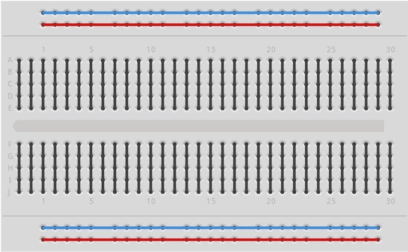

In deze workshop gaan we de temperatuur samen met datum en tijd loggen naar een SD kaart. Presentatie van deze workshop kun je [hier vinden](https://docs.google.com/presentation/d/1XHDRSEYP50TZxLUKir2bVfbAtpUMhwvs52Qhers0uQ8/edit?usp=sharing).

Het data logger shield heeft twee functies dit het makkelijk maken om een data logger van je Arduino te maken. De eerste functie is een SD kaart lezer, waarmee de Arduino de mogelijkheid krijgt zeer veel data op te slaan. De tweede functie is een real-time klok, een chip die met behulp van een kleine batterij de datum & tijd kan onthouden. Daardoor heeft de Arduino altijd de beschikking over de juiste datum & tijd, ook al is de stroom uitgeschakeld geweest.

### Benodigde onderdelen voor deze workshop

* Arduino Uno met USB kabel voor programmeren.
* breadboard met 3 kabeltjes
* Data logger shield met DS1307 real-time klok en SD kaartlezer
* SD kaart
* CR1220 batterij voor de real-time klok
* MCP9701E temperatuur sensor

#### Arduino Uno

Als onderdeel van je workshop kit heb je een Arduino Uno ontvangen. Een Arduino Uno is een bordje gebaseerd op de Atmel ATMEGA328P microcontroller. Een microcontroller is een simpele computer waarbij het geheugen en de processor in een enkele chip samengevoegd zijn. De microcontoller op de Arduino Uno heeft 32KB programmageheugen, 1KB datageheugen en een processor met een snelheid van 16MHz.

De Arduino Uno heeft 13 digitale (aan & uit) aansluitingen die zowel als in- en uitgang kunnen worden ingesteld. Daarnaast heeft de Arduino Uno 6 analoge aansluitingen die naast analoog ook als digitale aansluiting kunnen worden gebruikt. Een deel hiervan wordt gebruikt voor functies op het data logger shield (pinnen 10 t/m 13 voor de SD kaart lezer en A4 en A5 voor de real-time klok) en voor communicatie met de computer (pinnen 0 en 1).


#### Breadboard

In deze les ga je een schakeling opbouwen op een breadboard. Een breadboard bevat gaatjes die in een patroon met elkaar verbonden zijn, waardoor je elektrische verbindingen kunt maken tussen de verschillende componenten die je er in plaatst.

De gaatjes van een breadboard zijn op de volgende manier met elkaar verbonden:



De zwarte lijntjes worden meestal gebruikt om componenten aan te sluiten, terwijl de rode en blauwe lijn meestal als voedingsrails gebruikt worden.

#### Data logger shield

Met de (data)shield kun je de functionaliteit van de Arduino op een eenvoudige manier uitbreiden. Let hierbij wel op welke pinnen door de shield gebruikt word en wat dan nog vrij is voor je eigen toepassingen. Voor de datalog shield worden pinnen A4,A5 (voor RTC klok) en 10 - 13 (voor SD card reader) gebruikt.

Mits er geen conflicten zijn in de gebruikte pinnen zou je zelfs meerdere shields op elkaar kunnen stapelen.

#### MCP9701E Temperatuur sensor

Deze temperatuursensor sluit je aan op de (5 volt) voedingsrail van je Arduino. De sensor geeft vervolgens een analoge spanning van 0 tot 5 volt die lineair in verhouding staat tot de temperatuur. Dit maakt het mogelijk om de temperatuur te meten met een analoge ingang en een simpele berekening.


* Pin 1: Voeding (5v)
* Pin 2: Analoge uitgang (0-5v afhankelijk van de temperatuur)
* Pin 3: Ground (voedings referentie)

[Datasheet MCP9701E sensor](MCP970X.pdf)

## Aansluiten van de MCP9701E op een Arduino Uno

Je sluit de sensor als volgt aan op de Arduino. Gebruik hiervoor de meegeleverder breadboard met kabeltjes.


### Het computerprogramma

Nu de temperatuursensor is aangesloten op de Arduino is het tijd voor het programmeren van de microcontroller op de Arduino Uno. Het programma bepaald het gedrag van de microcontroller, het doel van deze eerste stap is het uitlezen van de temperatuursensor en het naar de computer sturen van de gelezen temperatuur.

#### Functies

Een Arduino programma bestaat altijd uit in ieder geval twee functies: `setup` en `loop`. De `setup` functie wordt één keer uitgevoerd meteen nadat de microcontroller opstart. De `loop` functie wordt vervolgens in een oneindige lus herhaald.

```cpp
void setup() {

}

void loop() {

}
```

In de programmeertaal C wordt een functie gedefinieerd door het type van de waarde die de functie teruggeeft na het uitvoeren te definieren, gevolgd door de naam van de functie en binnen haakjes een lijst van parameters die worden meegegeven aan de functie. In ons geval geeft de functie geen waarde terug, daarom wordt het type van het resultaat als `void` gedefinieerd. De namen van de functies `setup` en `loop` volgen, waarna er een lege parameterlijst `()` wordt gespecificeerd. De setup en de loop functie hebben geen parameters en geven ook geen resultaat terug. De accolades `{}` geven aan welke code binnen de functie valt. Dit wordt ook wel een namespace genoemd.

#### Verbinding maken met de computer

De microcontroller is via een USB naar serieel conversiechip aangesloten op de computer. Op de computer krijgt de Arduino Uno een communicatie poort (`COM`) nummer toegewezen, aan de Arduino kant is er slechts één enkele poort. Om te communiceren moet de communicatiesnelheid aan zowel de computerkant als aan de Arduino kant op de zelde snelheid worden ingesteld. In dit voorbeeld gebruiken we een communicatiesnelheid van `9600` baud, dat betekent dat er 9600 bits per seconde verstuurd worden.

Het programma:

```cpp
void setup() {
  Serial.begin(9600);
}

void loop() {
  Serial.println("Hello world");
}
```

In de setup functie die één keer wordt uitgevoerd stellen we de seriele poort in door de functie `Serial.begin` aan te roepen. Deze functie heeft één parameter: de communicatiesnelheid. Die wordt op `9600` baud ingesteld. De regel wordt vervolgens afgesloten met een `;`.

In de loop functie, die herhaald wordt uitgevoerd sturen we de tekst `Hello world` naar de computer toe. Dit wordt gedaan met de `Serial.println` functie. Deze functie stuurt de data, gevolgd door een regeleinde naar de seriele poort toe.

#### Uitlezen van de temperatuursensor

MCP9701E:

```cpp
void setup() {
  Serial.begin(9600);
}

void loop() {
  int analogCounts = analogRead(A0);
  float analogVoltage = (analogCounts * 5.0) / 1024.0;

  const float voltageAtZeroDegrees = 400 / 1000.0; //V
  const float temperatureCoefficient = 19.53 / 1000.0; //V
  float analogTemperature = (analogVoltage - voltageAtZeroDegrees) / temperatureCoefficient;

  Serial.println(analogTemperature);

  delay(500); // ms
}
```

LM35:
```cpp
void setup() {
  Serial.begin(9600);
}

void loop() {
  int analogCounts = analogRead(A1);
  float analogVoltage = (analogCounts * 5.0) / 1024.0;
  float analogTemperature = analogVoltage / 0.01;

  Serial.println(analogTemperature);

  delay(500); // ms
}
```


## DS1307 RTC Klok
Voor de realtime klok (RTC) word de DS1307 gebruikt, een populaire chip voor deze toepassingen. Met behulp van een batterij word ook de tijd bijgehouden als er geen stroom op staat. 

[Datasheet DS1307](DS1307.pdf)

### Hardware
In deze workshop gebruiken we de RTC klok die op de data logger shield zit. Hiermee word de klok aangesloten.

Intern gebruikt de datashield pinnen A4 (SLA) en A5 (SCL). Deze pinnen kunnen dus niet meer voor andere functies gebruikt worden. Wel zou je andere devices/chips op kunnen aansluiten die ook de [I2C communicatie](https://docs.arduino.cc/learn/communication/wire) ondersteunen.

### Code
Voor het programma hebben we ook een extra library nodig. We gebruiken hier de 'RTCLib by Adafruit', zoek deze in de Library manager en installeer deze.

```cpp
#include "RTClib.h"

RTC_DS1307 rtc;

char daysOfTheWeek[7][12] = {"Sunday", "Monday", "Tuesday", "Wednesday", "Thursday", "Friday", "Saturday"};

void setup () {
  Serial.begin(9600);

  if (! rtc.begin()) {
    Serial.println("Couldn't find RTC");
    Serial.flush();
    while (1) delay(10);
  }

  if (! rtc.isrunning()) {
    Serial.println("RTC is NOT running, let's set the time!");
    // When time needs to be set on a new device, or after a power loss, the
    // following line sets the RTC to the date & time this sketch was compiled
    rtc.adjust(DateTime(F(__DATE__), F(__TIME__)));
    // This line sets the RTC with an explicit date & time, for example to set
    // January 21, 2014 at 3am you would call:
    // rtc.adjust(DateTime(2014, 1, 21, 3, 0, 0));
  }
}

void loop () {
    DateTime now = rtc.now();

    Serial.print(now.year(), DEC);
    Serial.print('/');
    Serial.print(now.month(), DEC);
    Serial.print('/');
    Serial.print(now.day(), DEC);
    Serial.print(" (");
    Serial.print(daysOfTheWeek[now.dayOfTheWeek()]);
    Serial.print(") ");
    Serial.print(now.hour(), DEC);
    Serial.print(':');
    Serial.print(now.minute(), DEC);
    Serial.print(':');
    Serial.print(now.second(), DEC);
    Serial.print("  unix timestamp ");
    Serial.print(" (seconds since midnight 1/1/1970) ");
    Serial.print(now.unixtime());
    Serial.println();
    delay(3000);
}
```

## SD Card logger

### Hardware
Voor de SD card reader zijn 4 pinnen nodig voor de communicatie , voor onze datashield word hiervoor pin 10 t/m 13 gebruikt.

* pin 10 (CS) 
* pin 11 (DI) 
* pin 12 (DO)
* pin 13 (CLK)

Je hebt natuurlijk ook pinnen nodig voor de 5V en GND

### Code
Programma om informatie te loggen naar SD card. In dit voorbeeld is dit niet een echte meting maar een test waarde om de werking te testen.

```cpp
#include <SPI.h>
#include <SD.h>

const int pinChipSelect = 10;

void setup() {
  pinMode(pinChipSelect, OUTPUT);
  digitalWrite(pinChipSelect, HIGH);

  Serial.begin(9600);

  while (!SD.begin(pinChipSelect)) {
    Serial.println("Failed to init SD card, trying again in 500ms...");
    delay(500);
  }
  Serial.println("SD card initialized!");
}

void log(unsigned long time, float temperature) {
  String logLine = String(time) + "," + String(temperature);
  Serial.println(logLine);
  File dataFile = SD.open("data.txt", FILE_WRITE);
  if (!dataFile) {
    Serial.println("Failed to write to the SD card");
    return;
  }
  dataFile.println(logLine);
  dataFile.close();
}

void loop() {
  unsigned long time = millis();
  float temperature = 13.37;
  log(time, temperature);
  delay(1000);
}
```

Zie ook [Adafruit data logger shield](https://learn.adafruit.com/adafruit-data-logger-shield)

## Oefening

Combineer bovenstaande oderdelen tot 1 geheel. Gebruik de waarden van de temperatuur sensor om deze naar de SD kaart te schrijven.
